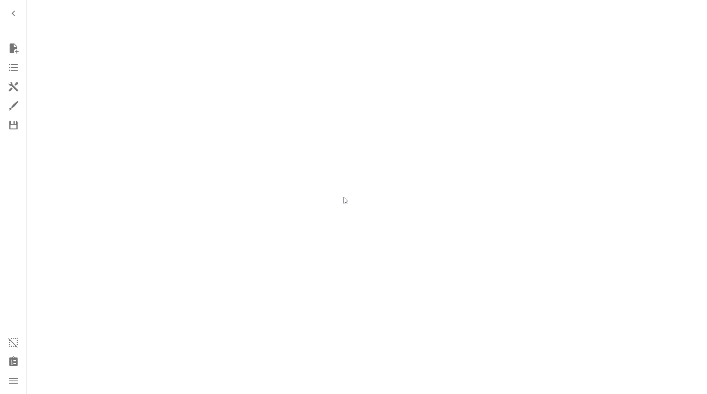
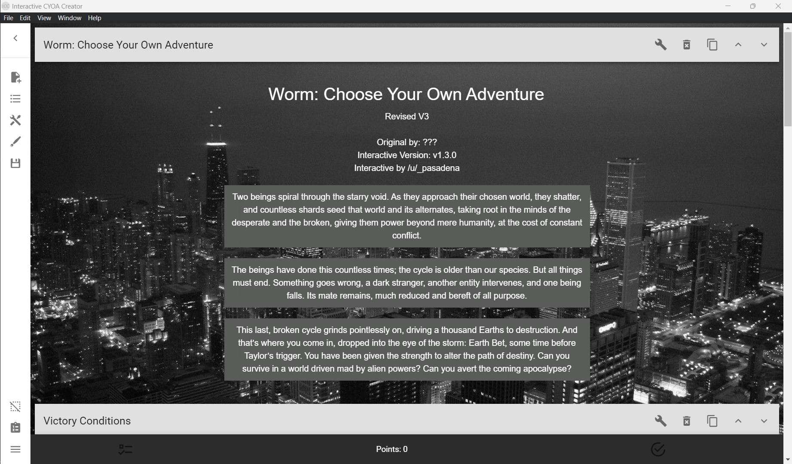
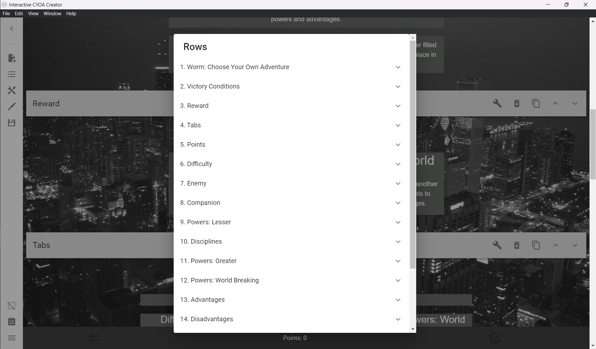
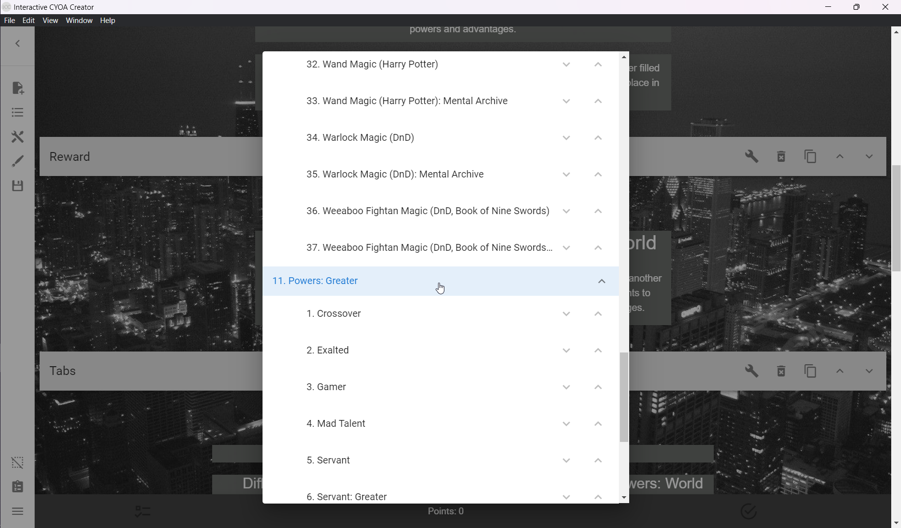
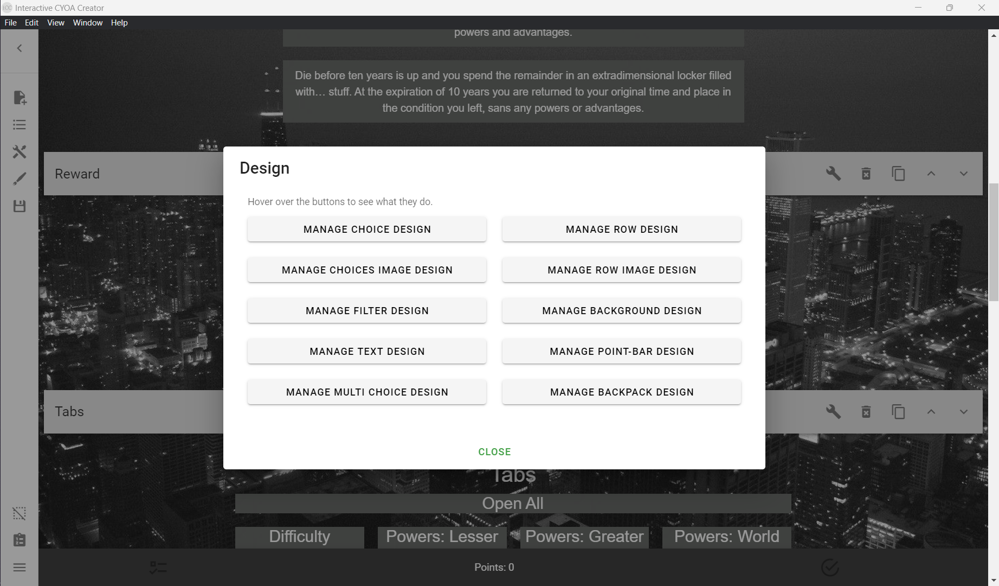
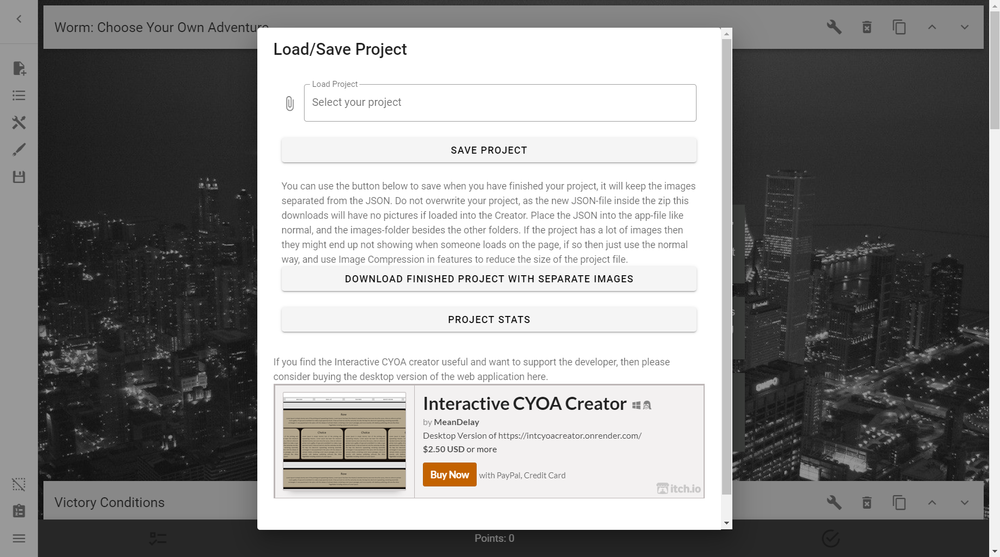
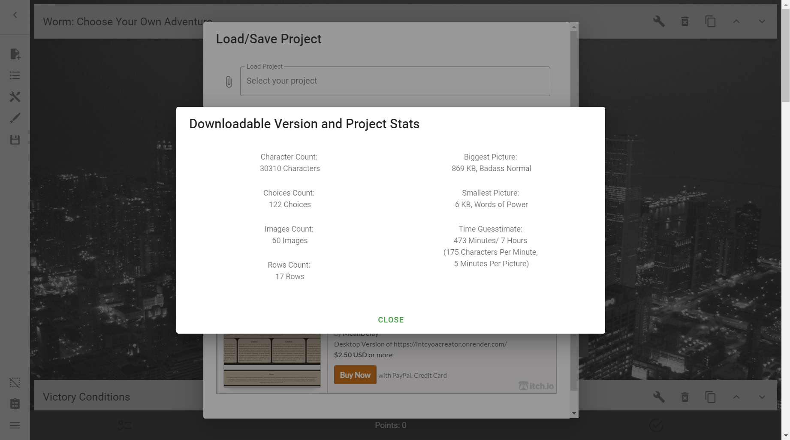
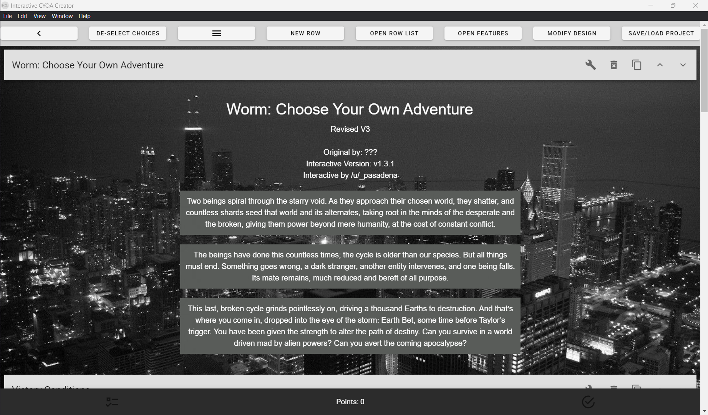
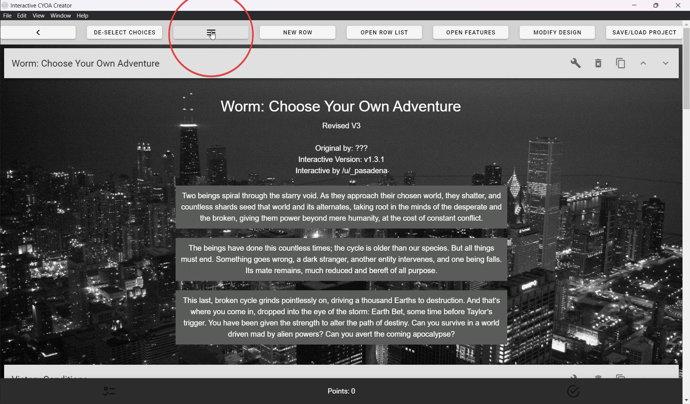

# Basics
This section of the tutorial will be focused on familiarizing you with the
basics.

## Launching the Creator
When you launch the creator for the first time, you will be greeted with this
screen:

### Open Image-CYOA Creator
This is where you go to create **Interactive CYOAs**.

When you first open it, you will be greeted with a blank screen and a minimized
sidebar. To learn more about the sidebar, go to [The Sidebar](#the-sidebar).

This is what a complete CYOA would look like in this menu:

### Open Image-CYOA Viewer
This is where you can preview CYOAs before you upload them.

!!! warning

    Options selected in the viewer will persist in the editor, so make sure you
    [reset the options](../mechanics/objects/#resetting-objects). Otherwise,
    playtest your CYOAs using a separate instance, or by launching it with the
    official Viewer html files.

    You can use this fact to your advantage by selecting default choices.

### Help and Instructions
A small tutorial made by the author themself. It should be redundant with this
tutorial, but you may wish to check it out anyway.

Parts of that tutorial will be quoted throughout this one.

## The Sidebar
The sidebar is how you manoeuvre around the creator. Please note that the
sidebar is only accessible if you hover over it.

### Return To Menu
This takes you back to the [start][2].

### Create New Row
This is how you create rows. See more [here][1].

### Open Row List
This lists all the rows inside of the interactive. It lists them with their ID
by default, but if given a title, it will use that instead.

You can select individual rows to expand them and see choices:

By pressing on the arrows, you can quickly move Objects around.

By dragging on the Rows, you can quickly move Rows around.

### Open Features
Pressing _Open Features_ will present you with one of the most important menus
in the creator. It grants you access to a lot of the mechanics, such as
[points], [defaults], the [Backpack and Choice Import], and [image
compression].

All of these features will be elaborated later on, so they won't be talked
about in detail here.

### Modify Design
The _Modify Design_ button will open up the key to designing your CYOA. This is
quite important if you wish for your CYOA to be approachable and visually
appealing. You can learn more about it [here](../styling/).

### Save/Load Project
This menu is a place you'll become quite familiar with when creating CYOAs, as
this is where you will go to save, load, and export your project.

!!! tip

    **Save and save often!**

    Crashes during creation are not unheard of, and the chance increases the
    larger your `project.json` is. Make sure you save often.
    
    It is also advisable to keep backups, either on the cloud or with a
    different name locally. If you save an irreversible or time-consuming
    mistake, then it's easier to save from a previous version.

* **To save a project**, simply press _Save Project_, and save the
`project.json` somewhere convenient. This should be its own folder, and in the
same place as your Viewer files.
* **To load a project**, simply press the input labelled _Load Project_ with
the placeholder text _Select your project_. This will open a file dialogue
where you can select a previous `project.json`.

    !!! danger

        Do **NOT** drag your JSON file into the "Load Project" dialogue box. It
        is a button and dragging the file on it—if in a web browser—will simply
        replace your browser window with the file.

        This is bad because if you had unsaved work, it would all disappear.

* **To export a project**, press _Download Finished Project with Separate
Images_. This will give you the option to save a `hello.zip` containing your
CYOA. Rename it at your leisure.

    After you've saved it somewhere, extract it. You will notice that, if your
    project was large enough, the `project.json` is much smaller than before.
    This is because it separated the images from the project.json, allowing for
    faster loading times.

    If you have lots of images, then exporting might not be your best option.
    As the creator itself says:

    !!! quote

        If the project has a lot of images then they might end
        up not showing when someone loads on the page, if so then just use the
        normal way, and use Image Compression in features to reduce the size of
        the project file.

---

This menu also allows you to see the stats of your project, such as character,
choice, image, and row count. Access this by selected **Project Stats**.

### Clean Selected Choices
As warned above, if you've used the Viewer and selected choices whilst
developing at the same time, then when you go back into the creator, you may
notice that the choices are still selected.

This button provides an easy way to clear selected choices.

### See ID/Title List
This button provides a quick reference to the titles, choices, and what [IDs]
each of them have. This is **incredibly** powerful, especially in conjunction
with ++ctrl+f++ / ++cmd+f++, as it allows you an overview of your entire
project without having to open all rows and objects.

You can use this to find the ID of an Object using its title, and vice versa.

### Use Alternate Menu
The Alternate Menu is an alternative way of displaying the sidebar, this time
at the top of the creator rather than the side.

It was actually what the sidebar used to look like, before it was changed to
how it is now.

#### Returning to the Default Menu
If you ever go into this menu and wish to return back to the default
appearance, simply press the three-line button between _De-Select Choices_ and
_New Row_, as shown here:

<!-- URLs -->
[1]: ../mechanics/rows/#creating-rows
[2]: ./#launching-the-creator
[points]: ../mechanics/points-and-scores/
[defaults]: ../mechanics/defaults/
[Backpack and Choice Import]: ../mechanics/backpack-and-choice-import/
[image compression]: ../mechanics/images/#image-compression
[IDs]: ../mechanics/ids-and-requirements/