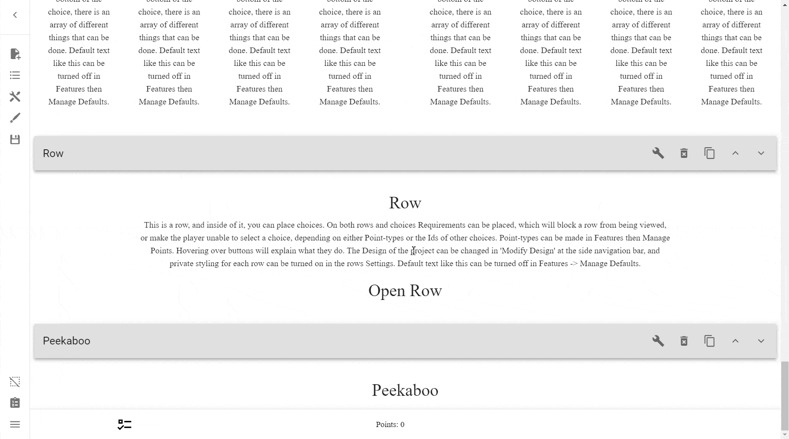
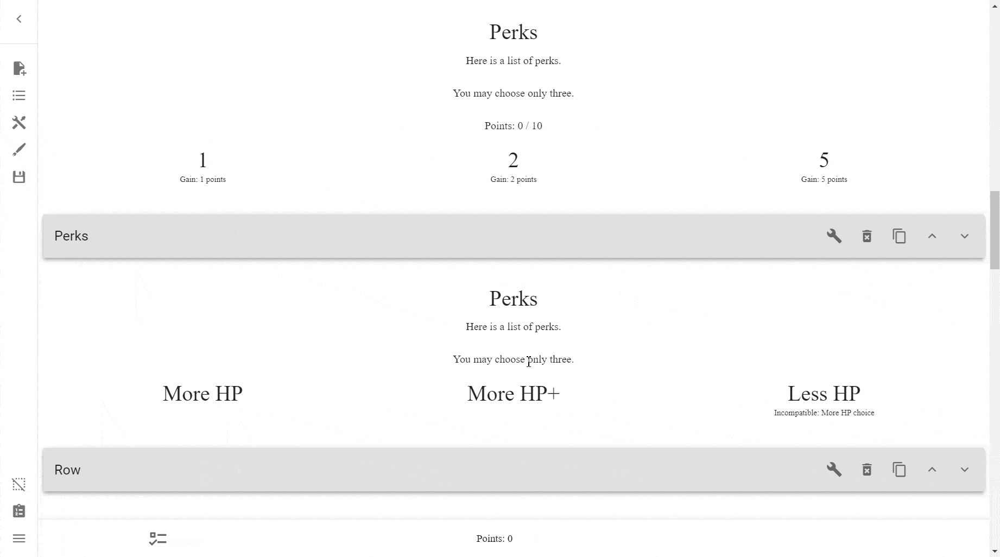
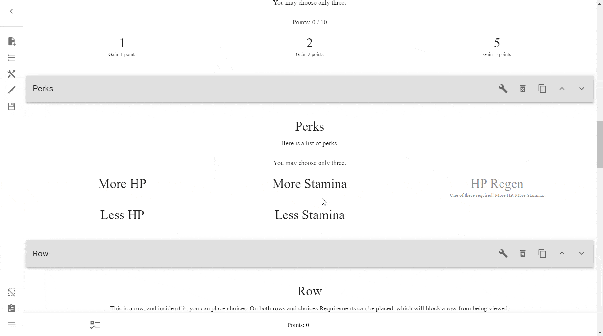
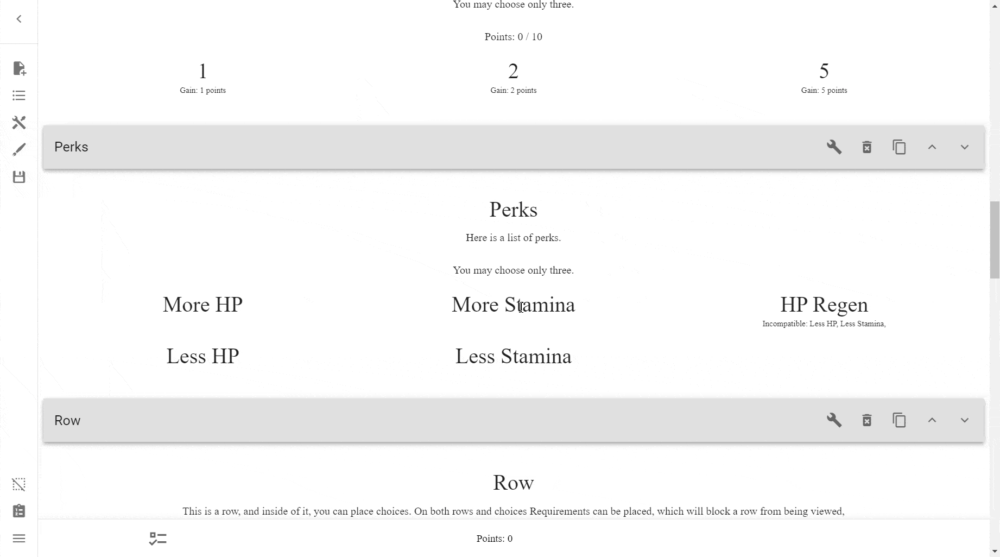
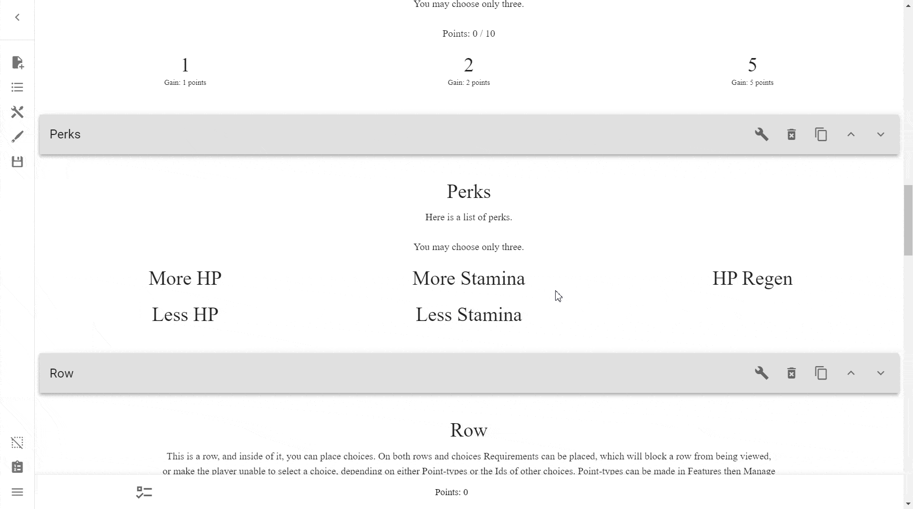
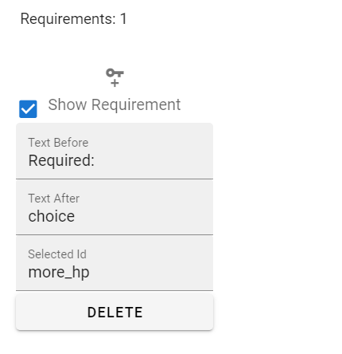

# IDs & Requirements

## IDs – Unique Identifiers
IDs are unique identifiers that allow the ICC to directly 
access any object, whether that be Rows, Choices, Points, or Groups.

They are particularly useful in situations where you have many choices that 
have requirements, meaning that if you assigned IDs according to regular, 
predictable rules, you would not need to contantly check for the IDs of those
choices.

When you create any object, whether a Row, Choice, Point type, etc, they will
be assigned a random 4-digit hex ID.

!!! warning

    It is **strongly** suggested that you change default IDs.

    If you do not, it makes it **incredibly difficult** to understand and 
    modify choice interactions.

    Start by making a sensible ID format that you can apply to **every** Row,
    Choice, Point, etc. This will make things **much** easier when the project
    starts getting large and convoluted, making the various interactions
    **much** easier to understand and track.[^1]

    An example of a format is sorting based on object type:

    | Object type    | ID Format        | Example              |
    | -------------- | ---------------- | -------------------- |
    | **Row**        | `row_{title}`    | `row_perks`          |
    | **Choice**     | `choice_{title}` | `choice_immortality` |
    | **Point type** | `point_{title}`  | `point_companions`   |

    Or perhaps sorting by row/section name:

    | Section name      | ID Format           | Example              |
    | ----------------- | ------------------- | -------------------- |
    | **Perks**         | `perk_{title}`      | `perk_noctis_cape`   |
    | **Drawbacks**     | `drawback_{title}`  | `drawback_powerless` |
    | **Powers**        | `power_{title}`     | `power_alexandria`   |
    | **Companions**    | `companion_{title}` | `companion_taylor`   |
    | **{Section/Row}** | `section_{title}`   | `section_perks`      |
    | **{Point}**       | `point_{title}`     | `point_companions`   |

## Requirements
Requirements are conditions that a Row must fulfil before it is shown and an
Object must fulfil before it can be selected.

!!! quote "ICC Quote"

    Requirements are conditions that will decide if the player can select the 
    choice or not, these use the ID of choices and variables, and the design of
    the filter placed on non-selectable choices can be changed in filter
    design.

### Adding Requirements
To add requirements to any object, press the icon that looks like a a key above
a plus sign. For Rows and Choices, you will have to enter their Edit menu
first.

=== "Rows"

    

=== "Choices"

    

### Create Requirement Menu
The **Create Requirement** menu is the interface through which requirements are
added to objects.

#### Selected Choice
When the **Add Selected Choice Requirement** option is selected, it means that
the Choice with the corresponding ID **MUST** be selected in order for that
requirement to be satisfied.

It acts as an IF conditional:

* IF a Choice with this ID is selected, THEN allow this object to be
selected, or allow this Row to be shown.

=== "After"

    

=== "Before"

    

=== "Process"

    

#### Non-selected Choice
When the **Add Non-selected Choice Requirement** option is selected, it means
that the Choice with the corresponding ID must **NOT** be selected in order for
the requirement to be satisfied.

This option is the inverse of the above, acting as an IF-NOT conditional:

* IF a Choice with this ID is NOT selected, then allow this object to be
selected or shown.
* IF a Choice with this ID IS selected, do NOT allow this object to be
selected or shown.

=== "After"

    

=== "Before"

    

=== "Process"

    

#### 'One of these is selected' requirement
When this requirement is selected, you must provide the creator with a number
of IDs. If any of them are selected, then this object is allowed to be selected
or shown.

By default, it will create 4 fields with which to enter IDs in. You cannot
dynamically change this number. Instead, in the menu you have to change the
number in the **Number of requirements** field below the button, before
creating a new requirement on the object.

This requirement functions as an OR logic gate:

* If X or Y or Z (etc) is selected, then allow this object to be selected or 
shown.

!!! tip

    If you need to change the number of requirements for either this
    requirement or the one below, then instead of deleting the old requirement
    and creating a new one, create the new one first, so that you can simply
    cut and paste the old values into the new requirements.

!!! note

    It's fine to have more requirement fields than you need, as empty fields
    will simply be ignored.

!!! note

    If you want an **All of these are selected** requirement, please see
    [here](../../reference/#all-of-these-are-selected-requirement).

=== "After"

    

=== "Before"

    

=== "Process"

    

#### 'One of these is not selected' requirement
<!-- The inverse of the above requirement, in order for this requirement to be
satisfied, as it says, one of the Choice IDs must not be selected. -->

<!-- This requirement functions as a NAND gate. -->

Contrary to the name and not exactly the inverse of the above requirement, in 
order for this requirement to be satisfied, ==ALL== of the Choice IDs 
must **not** be selected.

This requirement functions as a NOR gate:

* If ALL objects are NOT selected, then allow the choice to be selected or row
to be shown.

!!! note

    If you want a **None of these are selected** requirement, see
    [here](../../reference/#none-of-these-are-selected-requirement)

=== "After"

    

=== "Before"

    

=== "Process"

    

#### Combining Multiple Requirements
Chaining multiple requirements onto one object means that you require all of
those requirements in order to allow the object to be chosen or shown.

!!! note

    You can use multiple requirements and scoring to make discounts on options.

    An example of this logic in pseudocode would be:
    
    * "If this choice that gives a discount is selected, then it costs 5
        points"
    * "If this choice that gives a discount is not selected, then it costs
        10 points"

    You can learn more [here](../../reference/#making-discounts).

#### Nesting Multiple Requirements
Nesting multiple requirements means to apply requirements onto requirements
themselves. This type of advanced behaviour can get quite unwieldy.

### Hiding Rows via Selected Choice
Rows can be hidden by using the **Add Selected Choice** requirement. In order
to open a Row, you would need to select a choice.

!!! tip

    Doing this is **highly** recommended when an ICYOA becomes long enough.

    This can be used to create a 'Tabs' / Table of Contents menu, which is gone
    into more detail about [here](../../reference/#table-of-contents-tab-menu).

#### Nested Rows
While nested Rows can be useful, especially for long ICYOAs which require a
**lot** of scrolling, there can be a couple of downsides.

1. Nesting more than 2 down levels can lead users to be confused and annoyed as
    to where certain sections are.
2. If Nested Rows are not set up properly, they can leave Orphaned Rows.

Orphaned Rows occur when a chain of Nested Rows aren't set up so that closing
the topmost parent Row closes not just any Rows that depend on it, but also
Rows that depend on the topmost Row's dependent, and so on and so forth.

To do this, use [Selected Choice][sc] requirements for each nesting level.

=== "After"

    

=== "Before"

    

=== "Process"

    

[u/Traveller-81] goes into more detail here:

??? quote "Tips and Pitfalls for Interactive CYOA Creators (Reddit)"

    The third common pitfall is row nesting, specifically how NOT to do it. Now
    nesting rows in and of itself isn't a bad thing. It prevents having to
    scroll through hundreds of choices to find the section you want (one of the
    few design flaws of the WoW ICYOA listed above). Instead, you design the 
    various rows to only show when the prerequisite choice is active, basically
    showing up at the push of a button. Nesting rows occurs when the button for
    a row is inside another row, which can be inside another row, and so on. 
    Overusing this can lead to your users being confused and annoyed, having to
    search through nested row after nested row to find the section they want.
    Not fun. Finding the right balance between "ALL THE CHOICES" and "Where the
    hell is it!" is important.

    Another problem with nested rows is avoiding orphaned rows. Orphaned rows 
    occur when attempting to close multiple levels of nested rows by closing
    the top row leaves the lower rows still visible. This is an annoying design
    flaw that forces your users to close nested rows in order, every time.

    What's worse is if the button for a nested row is a choice you want to
    keep, leaving you unable to close the orphan row without screwing up your 
    build. This is both aggravating and very unprofessional. To counteract
    this, require all your nested rows to need all previous levels active to 
    appear. Thus, if you close an upper level, it will close all lower levels.
    This does become slightly tedious to code the deeper a nested row is,
    however.[^1]

### Disabled Choices via Selected Choice
If you have some choices that have prerequisites/requirements, then having
them require those requirements will enforce that users don't cheat, and 
follow the rules.

#### Making Choices Invisible
Choices that don't have their requirements can be made invisible using filters.

!!! tip
    
    !!! warning

        Before you use private styling, make sure you've read and understood
        [this](../../styling/#important-advice).
    
    Unless your CYOA constantly and consistently wants to hide every choice
    that doesn't have its 

### Show Requirement
The **Show Requirement** checkbox allows the user to see the requirements just 
under the choice title. This is incredibly useful and much less tedious than
writing requirements underneath each choice manually.

=== "Checked"

    

=== "Not checked"

    

---

* **Text Before:** This is what shows before the Choice(s).
* **Text After:** As you can imagine, this shows after the Choice(s).
* **Selected Id:** The ID(s) relevant to the requirement. It will display the
Row/Choice title if one exists.

### Navigation with ID / Title list
ID / Title list as helpful way of navigating your way through a large CYOA – showcase JRPG Traitor 

### Reusing IDs
Interesting fact: Setting multiple things to the same ID allows you to activate one through the other 

<!-- References -->

[^1]: [Tips and Pitfalls for Interactive CYOA Creators (Reddit)](https://www.reddit.com/r/InteractiveCYOA/comments/wrf0hl/tips_and_pitfalls_for_interactive_cyoa_creators/)

<!-- URLs -->

[u/Traveller-81]: https://www.reddit.com/user/Traveller-81
[sc]: #selected-choice