# IDs & Requirements

## IDs – Unique Identifiers
IDs are unique identifiers that allow the ICC to directly 
access any object, whether that be Rows, Choices, Points, or Groups. Think of
them as a username, and objects within the ICC as a social media profile; in
order to access an object (a profile), the ICC requires an ID (a username).

They are particularly useful in situations where you have many choices that 
have requirements, meaning that if you assigned IDs according to regular, 
predictable rules, you would not need to contantly check for the IDs of those
choices.

When you create any object, whether a Row, Choice, Point type, etc, they will
be assigned a random 4-digit hex ID.

!!! warning

    It is **strongly** suggested that you change default IDs.

    If you do not, it makes it **incredibly difficult** to understand and 
    modify choice interactions.

    Start by making a sensible ID format that you can apply to **every** Row,
    Choice, Point, etc. This will make things **much** easier when the project
    starts getting large and convoluted, making the various interactions
    **much** easier to understand and track.[^1]

    An example of a format is sorting based on object type:

    | Object type    | ID Format        | Example              |
    | -------------- | ---------------- | -------------------- |
    | **Row**        | `row_{title}`    | `row_perks`          |
    | **Choice**     | `choice_{title}` | `choice_immortality` |
    | **Point type** | `point_{title}`  | `point_companions`   |

    Or perhaps sorting by row/section name:

    | Section name      | ID Format           | Example              |
    | ----------------- | ------------------- | -------------------- |
    | **Perks**         | `perk_{title}`      | `perk_noctis_cape`   |
    | **Drawbacks**     | `drawback_{title}`  | `drawback_powerless` |
    | **Powers**        | `power_{title}`     | `power_alexandria`   |
    | **Companions**    | `companion_{title}` | `companion_taylor`   |
    | **{Section/Row}** | `section_{title}`   | `section_perks`      |
    | **{Point}**       | `point_{title}`     | `point_companions`   |

!!! question "Why bother with a prefix?"

    While it's true that for smaller ICYOAs you could easily get away with IDs
    such as `noctis_cape` and `taylor`, for larger ones you may get
    complications where two or more Choices or Rows or anything else have the
    same name.

    Not only that, but keeping the prefix in mind means that when looking
    through Requirements, you'll be able to tell immediately which Row it comes
    from.

    All in all though, it's up to you how you format your IDs.

!!! tip

    Once a CYOA is publically released for the first time, it is recommended
    that you do NOT change the IDs of your Rows and Choices.

    This is for backwards-compatibility reasons; if you updated the CYOA with
    cool new features, and a player wanted to import their old build, they
    would not be able to.

    If you really *must*, you should probably indicate that to your audience,
    just so that they're aware.

## Requirements
Requirements are conditions that Rows and Addons must fulfil before they're
shown and Objects must fulfil before they can be selected.

!!! quote "ICC Quote"

    Requirements are conditions that will decide if the player can select the 
    choice or not, these use the ID of choices and variables, and the design of
    the filter placed on non-selectable choices can be changed in filter
    design.

### Adding Requirements
To add requirements to any object, press the icon that looks like a a key above
a plus sign. For Rows and Choices, you will have to enter their Edit menu
first.

=== "Rows"

    

=== "Choices"

    

### Create Requirement Menu
The **Create Requirement** menu is the interface through which requirements are
added to objects.

#### Choice Requirements

##### Selected Choice
When the **Add Selected Choice Requirement** option is selected, it means that
the Choice with the corresponding ID **MUST** be selected in order for that
requirement to be satisfied.

It acts as an IF conditional:

* IF a Choice with this ID is selected, THEN allow this object to be
selected, or allow this Row to be shown.

=== "After"

    

=== "Before"

    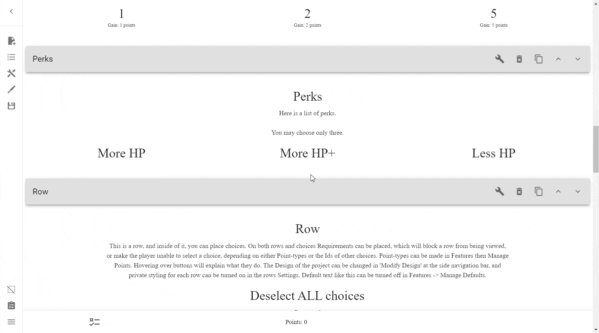

=== "Process"

    

##### Non-selected Choice
When the **Add Non-selected Choice Requirement** option is selected, it means
that the Choice with the corresponding ID must **NOT** be selected in order for
the requirement to be satisfied.

This option is the inverse of the above, acting as an IF-NOT conditional:

* IF a Choice with this ID is NOT selected, then allow this object to be
selected or shown.
* IF a Choice with this ID IS selected, do NOT allow this object to be
selected or shown.

=== "After"

    

=== "Before"

    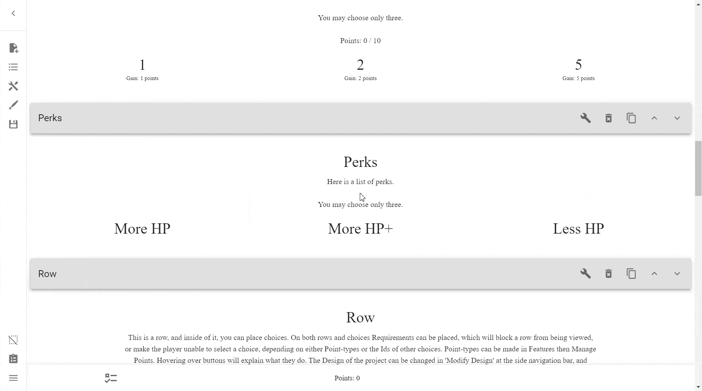

=== "Process"

    

#### Point Requirements
These requirements merely require you to have a certain *amount* of a given
Point Type.

!!! note

    Bear in mind though, that this doesn't take away points when comparing, and
    if you wanted to do both, you could always combine
    [a normal Score cost][score-cost] with
    [a Point Type that cannot go below zero][no-zero].

##### = Equal To
The **= Equal To** requirement is only satisfied when the specific Point Type
is equal and ONLY equal to the given value.

=== "After"

    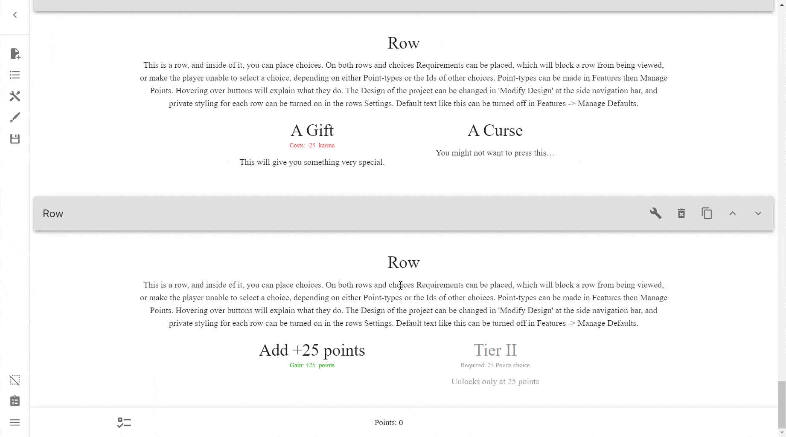

=== "Before"

    

=== "Process"

    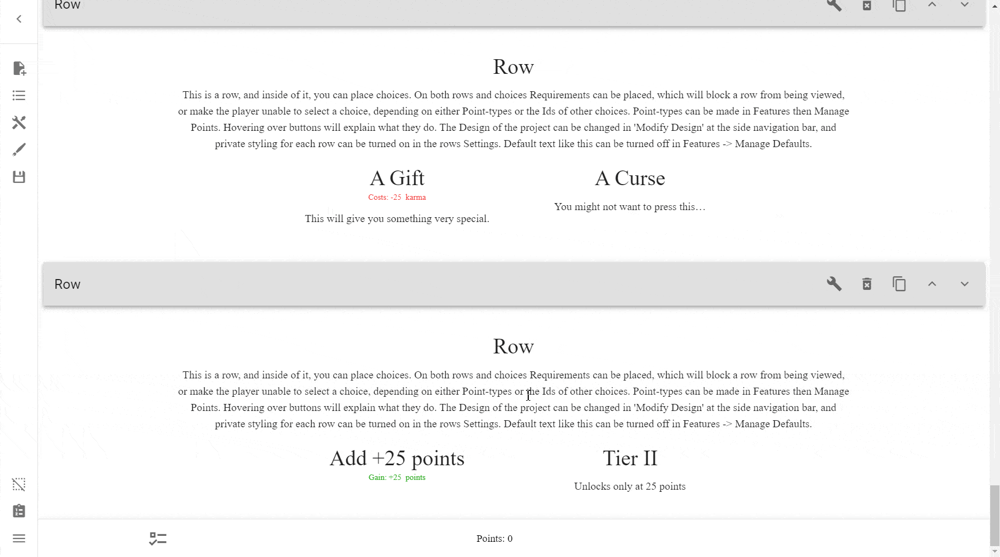

##### + More Than
The **+ More Than** requirement is only satisfied when the specific Point Type
is MORE than the given value.

=== "After"

    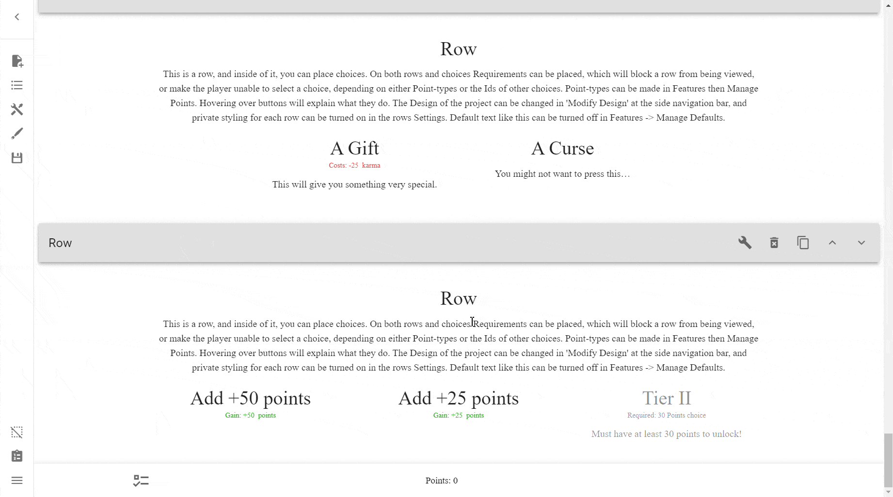

=== "Before"

    

=== "Process"

    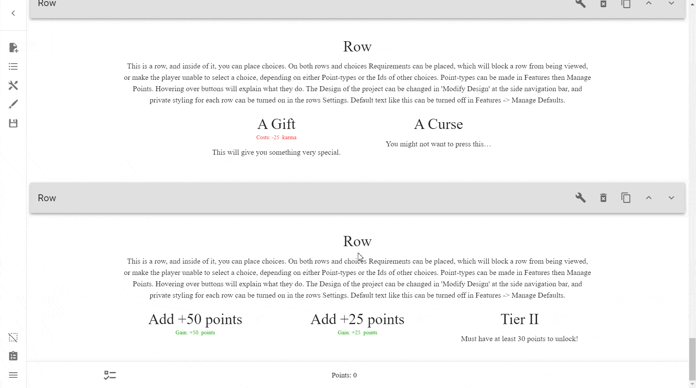

##### - Less Than
The **- Less Than** requirement is only satisfied when the specific Point Type
is LESS than the given value.

=== "After"

    

=== "Before"

    

=== "Process"

    

##### += More or Equal
The **+= More or Equal** requirement is only satisfied when the specific Point
Type is either:

1. MORE than the given value, or
2. EQUAL to the given value

It is a combination of the [More Than](#more-than) and [Equal To](#equal-to)
requirements.

=== "After"

    

=== "Before"

    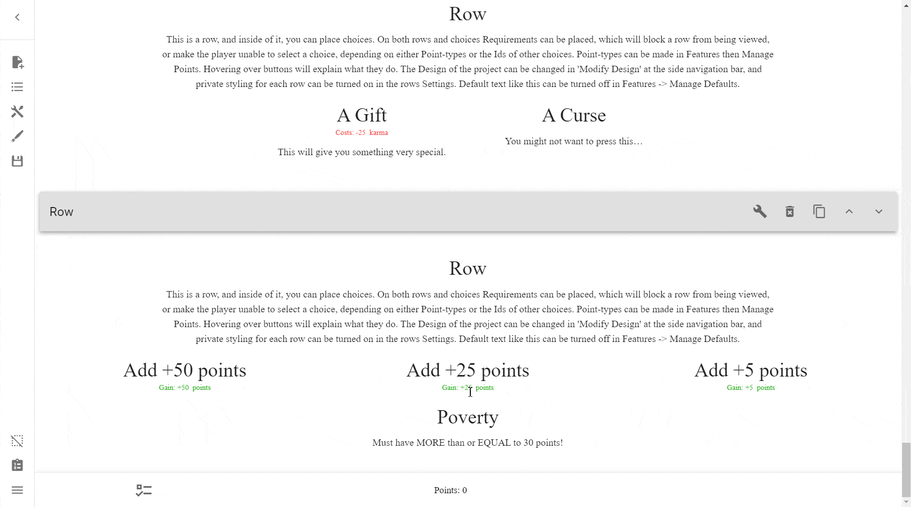

=== "Process"

    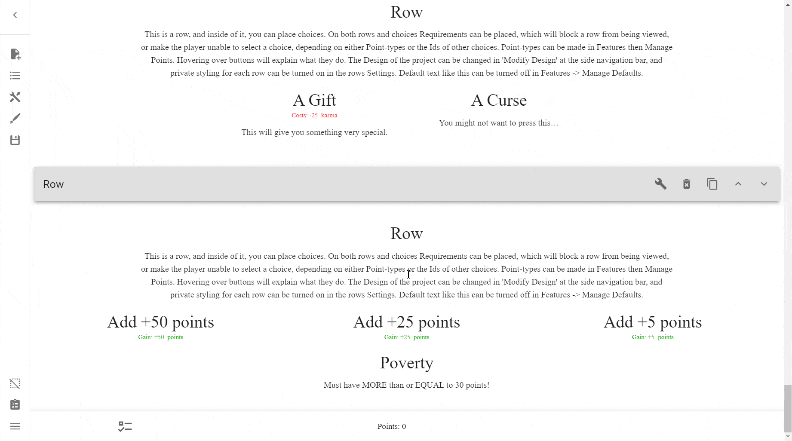

##### -= Less or Equal
The **-= Less or Equal** requirement is only satisfied when the specific Point
Type is either:

1. LESS than the given value, or
2. EQUAL to the given value

It is a combination of the [Less Than](#less-than) and [Equal To](#equal-to)
requirements.

=== "After"

    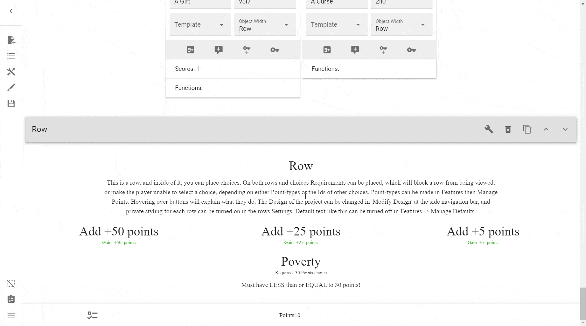

=== "Before"

    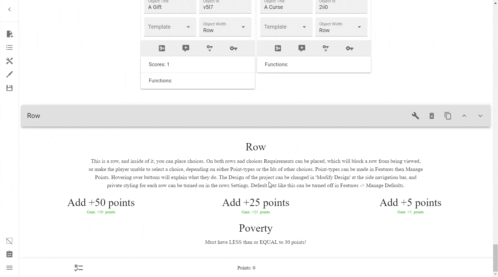

=== "Process"

    

#### Point Comparison Requirements
These requirements compare two or more Point Types between themselves.

##### This Point-Type is Bigger
This requirement is satisfied only when a given Point Type has a HIGHER value
than an other given Point Type.

=== "After"

    

=== "Before"

    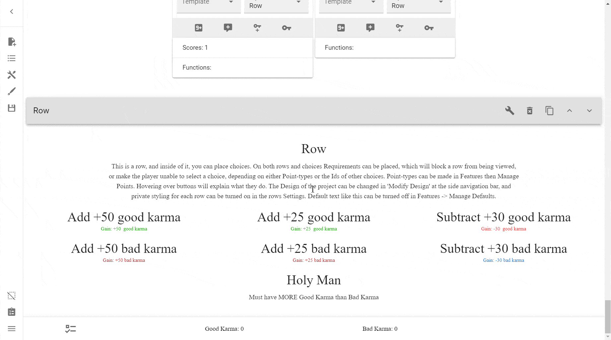

=== "Process"

    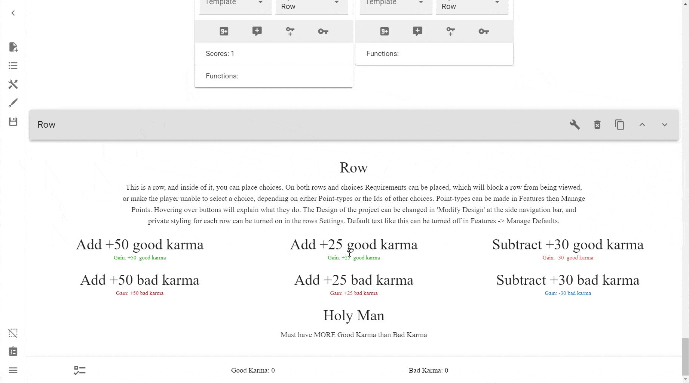

##### This Point-Type is Bigger or Equal
This requirement is satisfied only when a given Point Type either:

1. Has a HIGHER value than an other given Point Type, or
2. Has an EQUAL value with an other given Point Type

=== "After"

    

=== "Before"

    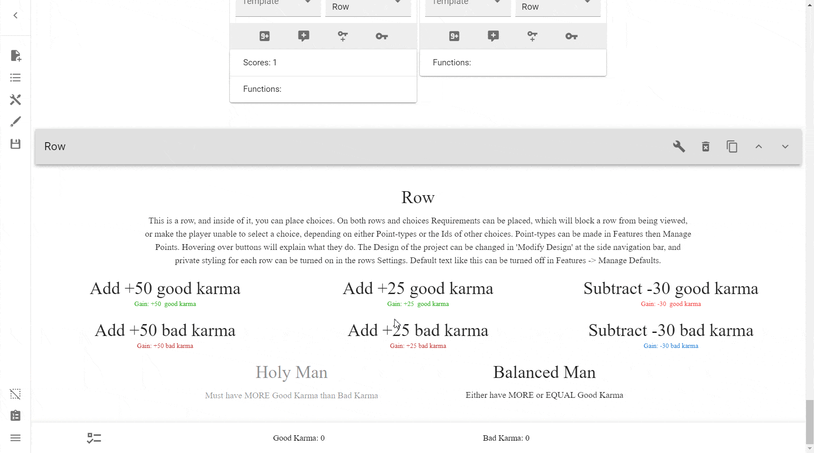

=== "Process"

    

##### These Point-Types are Equal
This requirement is satisfied only when a given Point Type is EQUAL with
another Point Type.

=== "After"

    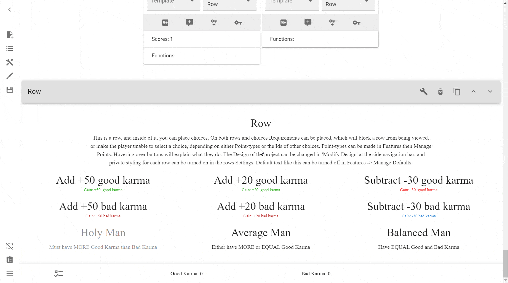

=== "Before"

    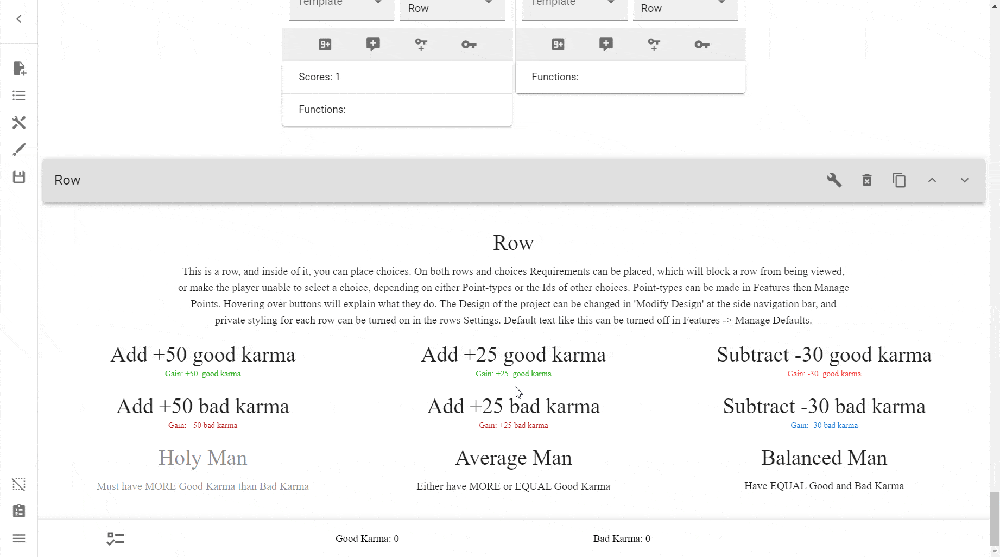

=== "Process"

    

#### 'One of these' Requirements
##### 'One of these is selected' requirement
When this requirement is selected, you must provide the creator with a number
of IDs. If any of them are selected, then this object is allowed to be selected
or shown.

By default, it will create 4 fields with which to enter IDs in. You cannot
dynamically change this number. Instead, in the menu you have to change the
number in the **Number of requirements** field below the button, before
creating a new requirement on the object.

This requirement functions as an OR logic gate:

* If X or Y or Z (etc) is selected, then allow this object to be selected or 
shown.

!!! tip

    If you need to change the number of requirements for either this
    requirement or the one below, then instead of deleting the old requirement
    and creating a new one, create the new one first, so that you can simply
    cut and paste the old values into the new requirements.

!!! note

    It's fine to have more requirement fields than you need, as empty fields
    will simply be ignored.

!!! note

    If you want an **All of these are selected** requirement, please see
    [here](../../reference/#all-of-these-are-selected-requirement).

=== "After"

    

=== "Before"

    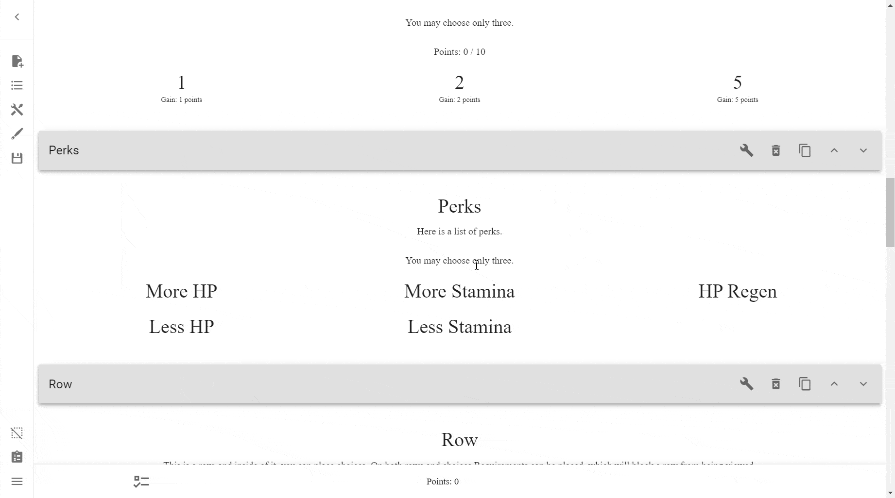

=== "Process"

    

##### 'One of these is not selected' requirement
<!-- The inverse of the above requirement, in order for this requirement to be
satisfied, as it says, one of the Choice IDs must not be selected. -->

<!-- This requirement functions as a NAND gate. -->

Contrary to the name and not exactly the inverse of the above requirement, in 
order for this requirement to be satisfied, ==ALL== of the Choice IDs 
must **not** be selected.

This requirement functions as a NOR gate:

* If ALL objects are NOT selected, then allow the choice to be selected or row
to be shown.

!!! note

    If you want a **None of these are selected** requirement, see
    [here](../../reference/#none-of-these-are-selected-requirement)

=== "After"

    

=== "Before"

    

=== "Process"

    

### Show Requirement
The **Show Requirement** checkbox allows the user to see the requirements just 
under the choice title. This is incredibly useful and much less tedious than
writing requirements underneath each choice manually.

=== "Checked"

    

=== "Not checked"

    

---

* **Text Before:** This is what shows before the Choice(s).
* **Text After:** As you can imagine, this shows after the Choice(s).
* **Selected Id:** The ID(s) relevant to the requirement. It will display the
Row/Choice title if one exists, otherwise it will display the ID.

---

Learn more about what you can do with [IDs][id-ref] and [Requirements][req-ref]
in the [Reference].

<!-- References -->
[^1]: [Tips and Pitfalls for Interactive CYOA Creators (Reddit)](https://www.reddit.com/r/InteractiveCYOA/comments/wrf0hl/tips_and_pitfalls_for_interactive_cyoa_creators/)

<!-- URLs -->
[u/Traveller-81]: https://www.reddit.com/user/Traveller-81
[sc]: #selected-choice
[id-ref]: /appendix/reference/#ids
[req-ref]: /appendix/reference/#requirements
[Reference]: /appendix/reference/
[score-cost]: ../points-and-scores/#creating-scores
[no-zero]: ../points-and-scores/#this-score-is-not-allowed-to-go-under-0