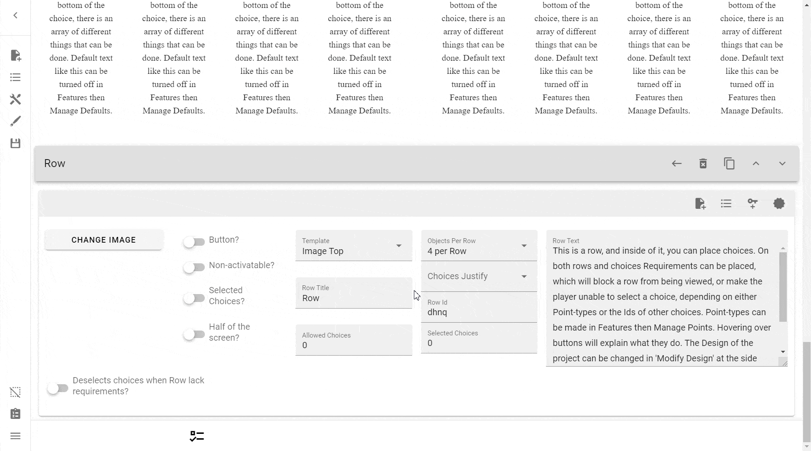
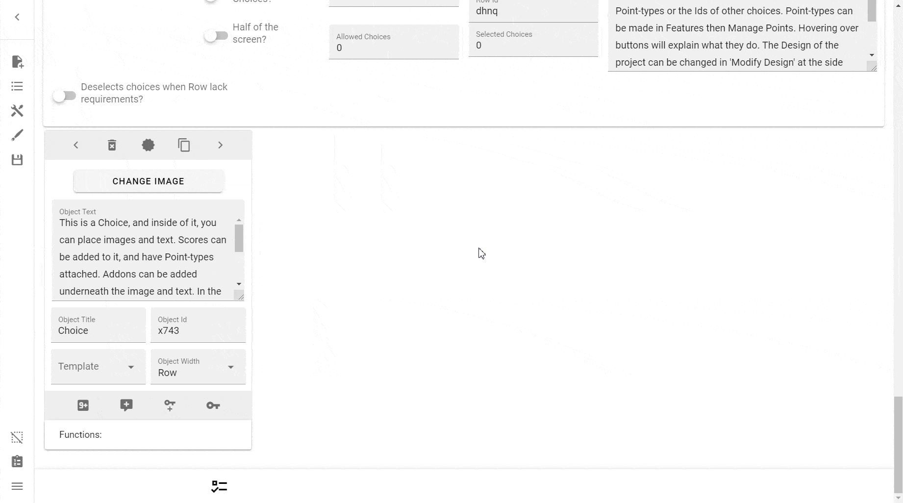
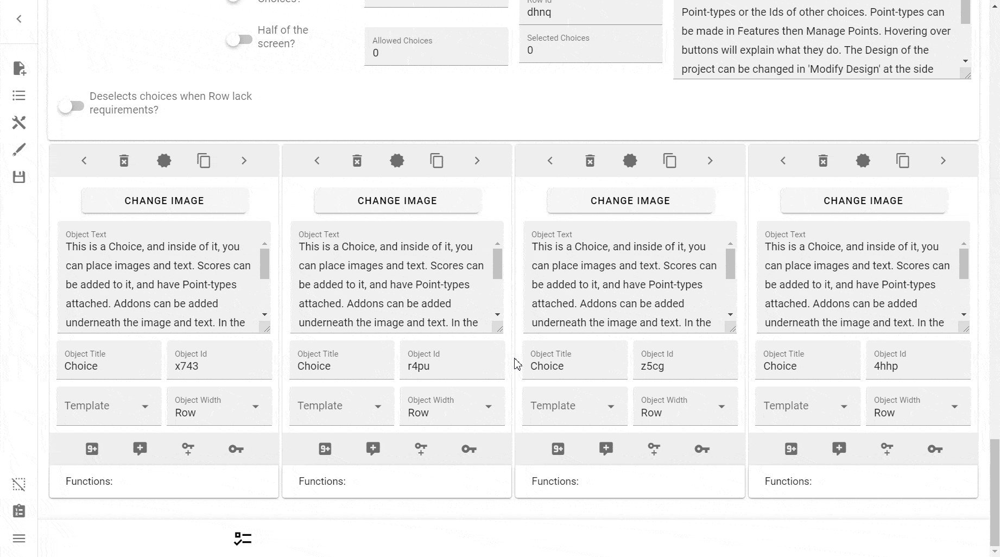
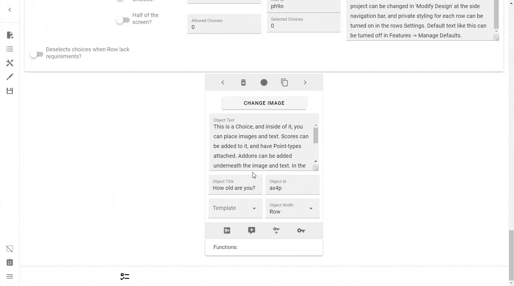
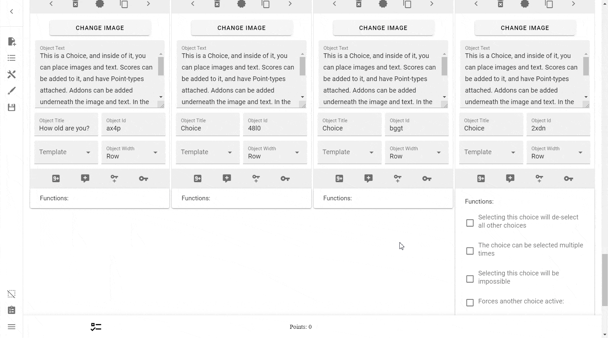

# Objects
**Objects**, also referred to as **Choices**, are _the_ most important element
of not just Interactive CYOAs, but CYOAs as a whole. Without Choice, you are
just left with a story or history.

In the context of the ICC, Objects are individual options that can be selected
by the player.

To do anything with Objects, you first must go into the **Edit Row** menu. You
can learn how to that [here](../rows/#editing-rows).

## Creating Objects
!!! note ""

    { align=left }

    To create an Object, press this button.



## Cloning Objects
!!! note ""

    { align=left }

    To clone or copy an Object, press this button.



## Deleting Objects
!!! note ""

    { align=left }

    To delete an Object, press this button.

!!! danger

    This action does **NOT** warn you when deleting an Object, so be extra
    careful when using this option.



## Resetting Objects
If you've accidentally activated choices, you can reset them using the 
following methods:

* Pressing **Clean Selected Choices** in the [Sidebar][sidebar_clean].
* Going into Choice Import and importing an empty ID list
* Manually deselecting them

## Object Width
Object Width, much like the [Objects per Row] option, specifies how many
Objects should fit within one row.

For example:

1. If you have two Objects, you might want to set them to **2 per Row**,
making it so that only two Objects would fit.
2. If you have six Objects, you might want to set them to **3 per Row**, making
it 2 columns times 3 rows.

!!! note

    You should not make the width too high. If you do, the row's Objects' text
    will be too skinny to be legible and too cramped to look good.

You can preview what this looks like [here][Objects per Row].

To learn more about the Object Width of 'Row', read [here][ropr].


## Functions
Functions are something you'll quickly become familiar with if you make ICYOAs
for a time. They are your bread and butter for interactivity between choices.

### Selecting this choice will de-select all other choices
!!! danger

    Be very careful when implementing this function. Unless the choice is
    clearly marked, it can harm players who might accidentally press on it.

This function will automatically deactivate **EVERY** choice in the ICYOA. 


### This choice can be selected multiple times
One of the most useful functions, this allows you to select a choice more than
once.

!!! tip

    Using a custom Point type to is ill-advised, because you need to create
    a new Point type each time you make a choice that can be selected multiple
    times.

    According to the official author:

    ???+ quote

        The point type used here should only be used for this choice, and it
        can be hidden by placing something in 'Id needed to activate' in 
        Features -> Manage Points.
    
    Therefore, it's easier to just use a simple variable every time.

You will be presented with two input fields:

* **Number where the minus will stop working:** This is your 'minimum' number.
You cannot go below this threshold.
* **Number where the plus will stop working:** This is your 'maximum number.
You cannot go above this threshold.

!!! info

    It's worth noting that the number used for the threshold relates to how
    many times you can press the buttons for increasing or decreasing.

    It will also stop you from going down or up if you lack the points
    required, and the Point type has the property 
    `This score is not allowed to go under 0`.



If you wish to make points go up or down with each press, simply add the score
as per usual. If you don't know how to do that yet, please see
[here][score].

### Selecting this choice will be impossible
Similar to the Row [Non-Activatable?] switch, but instead for a singular choice
instead of all choices in a Row.

!!! warning

    This is known to be quite buggy at times. Be careful with it.

### Forces another choice active
Another one of the more useful functions, this function will, given an ID of a
choice, forcibly activate another choice or a list of choices.


You can activate more than one choice at a time by separating the Object IDs
with a comma (but no space), e.g. this:

```
josf,ld2f,os9f,ls01
```

…will forcibly activate all four Objects.

Deactivating the enforcing choice will also deactivate any forcibly activated
Objects, but it will not deactivate any Objects that were selected beforehand.

!!! warning

    According to the creator of the ICC, this option works poorly if more than
    one Object possesses the same ID, or if a target has requirements attached.

    ???+ quote "ICC Quote"

        Works badly if multiple of these have the same ID, or if the target has
        requirements attached. You can use comma to activate multiple
        (ID,ID,ID).

### Will make another choice unselected
The inverse of the above function, it will instead forcibly deselect any IDs
passed into it.



### Adds or takes away a rows Allowed Choices
This function can be used to dynamically change what a Row's 
**Allowed Choices** number is.


#### Bypass Allowed Choices
If you have a Perk or any other reason why you would want to have an Object
within a Row with a limited amount of choices to not count as an Allowed
Choice, then you can bypass it by having the Object itself increase the
Allowed Choice by 1, whilst it naturally simultaneously takes 1 itself, leaving
with no difference.

### Clean Selected Choices (Side Menu)
See [here](../../introduction/#clean-selected-choices).

[sidebar_clean]: ../../Introduction/#clean-selected-choices
[Objects per Row]: ../rows/#objects-per-row
[ropr]: ../rows/#row-objects-per-row
[score]: ../points-and-scoring/
[Non-Activatable?]: ../rows/#non-activatable