# Points and Scores
## Points
!!! quote

    Point systems can be created and used to handle the player's ability to buy
    things and to keep a record of selected choices in a group or row.

### The Point Types Menu
To open the menu, go into **[the Sidebar]** → **Open Features** → **Manage
Points**.

### Creating Point Types
To create a Point Type, simply press **Create New Point Type**. Afterward, the
Point Type sub-menu will pop up, one for each Point Type:

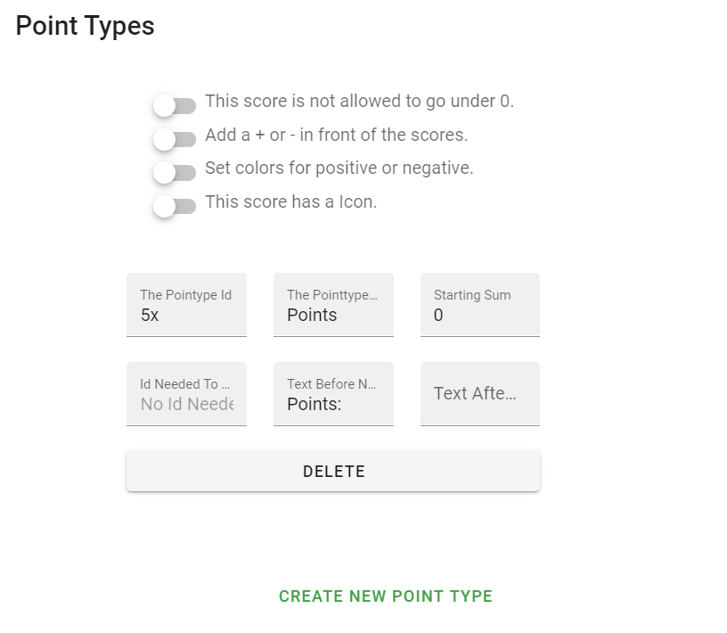

### Deleting Point Types
To delete Point Types, simply press the **Delete** button.

!!! danger

    This option does **NOT** ask for confirmation before deleting, so make sure
    you're extra careful around this option.

    Deleting a Point, especially for a larger CYOA, is incredibly
    time-consuming to recover from, so make sure you save often!

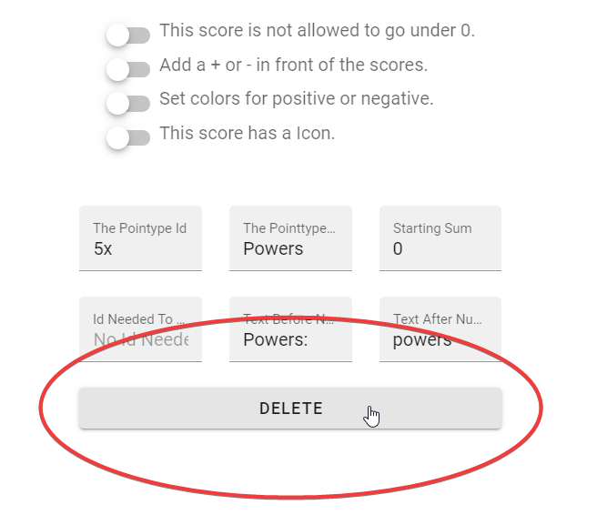

### The Pointtype Id
The **The Pointtype Id** input field is where you can assign your own [ID][ids]
to your Point Type.

### The Pointtype Name
To name a Point Type, simply enter the name in the **The Pointtype Name** input
box. Its full name is usually cut off however, though you can find it in the
centre of the top row.

### Starting Sum
The **Starting Sum** input field determines how many of that Point Type the
players will start with by default.

!!! note

    **Starting Sum** is always linked to the current value. That means if you
    select a choice by default for your user that affects this Point Type then
    it will change the Starting Sum too.

### Id Needed To Show
The **Id Needed To Show** input field is a special one. By placing the ID of a
[Choice][choice] there, the Point Type will not show in the Point Bar at the
bottom of the screen until the Choice with that ID is selected.

### Text Before Number
The **Text Before Number** input displays what is shown before its value on the
Point Bar.

Generally speaking, the recommended format for this is just your Point Type ID
without underscores and in title case, followed by a colon, such as `Points:`,
`Perks:`, or `Powers:`.

!!! note

    You do not need to place a space after the colon, it is done automatically.

### Text After Number
The **Text After Number** input is the opposite of above, and is what is shown
after the Point value.

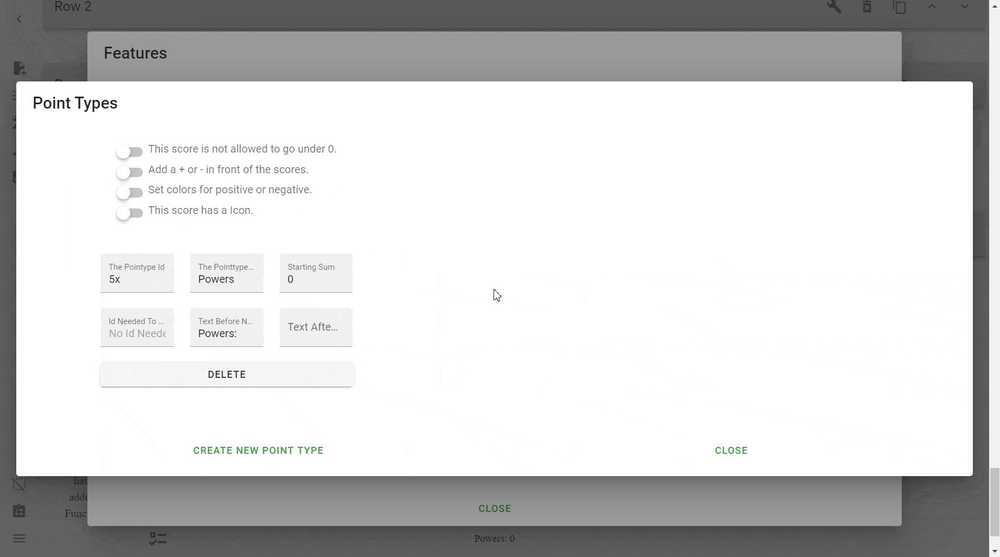

### Switches
These are the switches above the fields.

#### This score is not allowed to go under 0
This switch ensures that the score can **NEVER** go under 0. This means that if
a user does not have a surplus of that Point, such that using them on a Choice
would bring them into the negatives, then the Choice can not be selected.

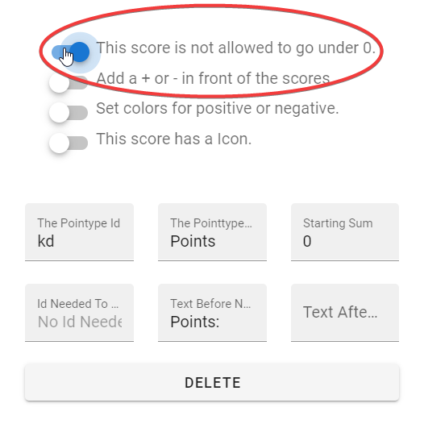

#### Add a + or - in front of the scores
This switch, as it says, prepends a positive or minus sign to the score of that
Point Type.

!!! note

    This does not affect Point Bar in anyway, but affects the Scores in
    Choices.

By default:

* If you gain points (i.e. the cost is in the negatives) it prepends a `+`
sign.
* If you lose points (i.e. the cost is in the positives) it prepends a `-`
sign.

This is a good thing to have on, because by default it does not show the
difference between positive (cost) and negative (gain), so you have to rely on
changing the Score's **Text Before** field.

=== "Switch On"

    

=== "Switch Off"

    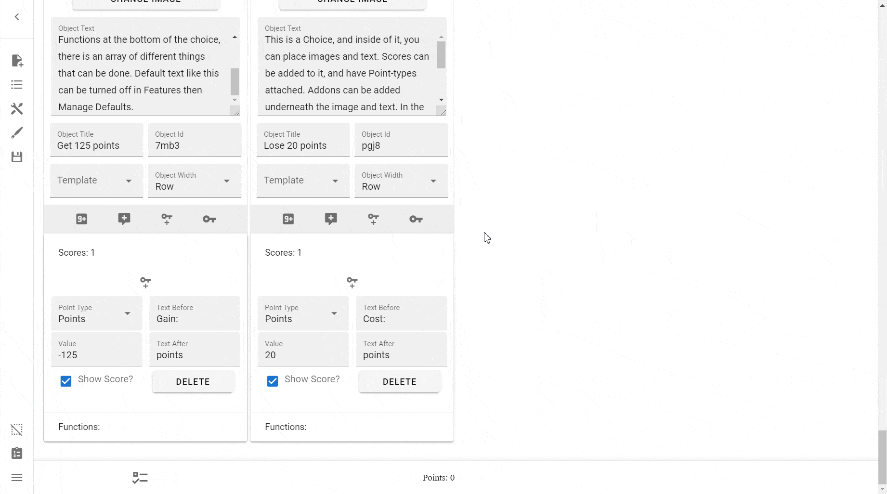

##### Invert the + and -
This is a hidden switch that is only activated when the above switch is
activated. The behaviour of this switch is as expected, it swaps around the
signs from the above switch.

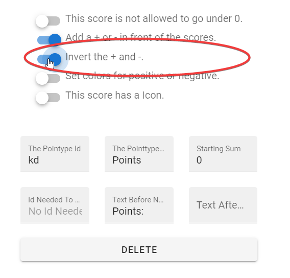

---

!!! note

    Both of the 'sign' options above do not change the actual functionality of
    gaining and losing Points, it simply changes their appearance.

#### Set colors for positive or negative
This switch changes the colours of the Points in the Point Bar depending on if
the value/score of the Point Type is positive or negative.

These colours are fully customizable, but, of course, it would be best to put
positive as green and negative as red. If you don't want your scores to stand
out normally, simply don't turn this on.

!!! warning

    Sometimes you might discover that once you turn the option on, even if you 
    turn off the colouring, it still happens. Should that be the case, simply 
    change the colour of both to `#000000FF` (black) or whatever colour the
    rest of your text is in.

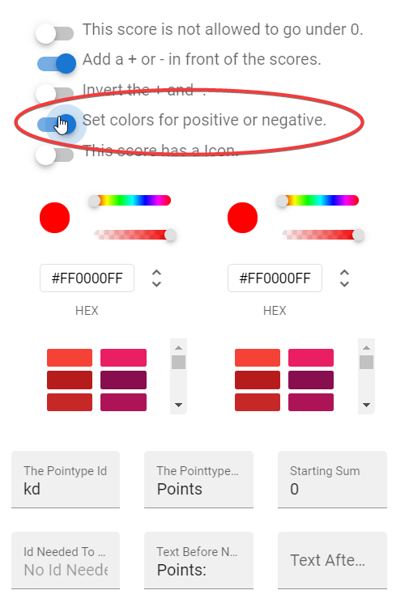

---

=== "With Colours"

    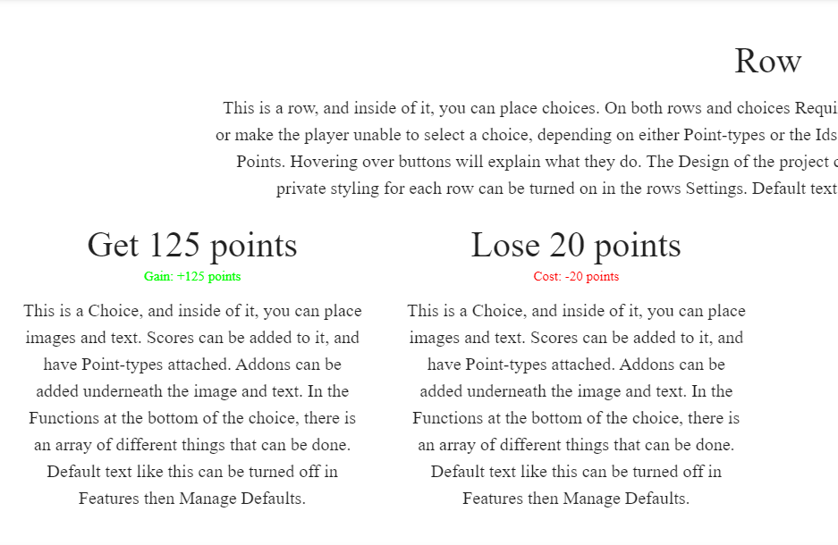

=== "Without Colours (Default)"

    

#### This score has an Icon
This switch opens up another subsection where you can change options for
uploading an icon to attach to your Point Type.

!!! note

    This does not show up in the Point Bar, but underneath Choices' titles

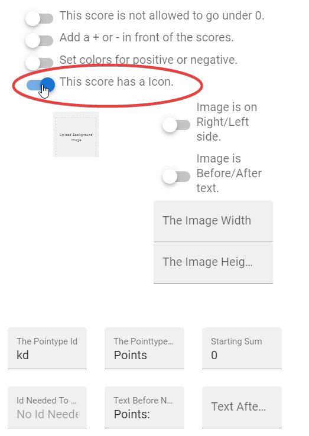

* **Upload Background Image:** This is where you upload the Icon for the Point
Type
* **Image is on the Right/Left Side:**
    * **Left unchecked:** The Icon will be to the left.
    * **Checked:** The Icon will be to the right. !!! note

        When referring to Right and Left, the creator thinks that if the switch
        is to the left, then it will go left, rather than applying the same
        order as "Right/Left".

* **Image is Before/After text:**
    * **Left unchecked:** The Icon is placed before the text.
    * **Checked:** The Icon is placed after the text.

| Formats    | Left Side              | Right Side             |
| ---------- | ---------------------- | ---------------------- |
| **Before** | `{Icon} Cost: 1 point` | `Cost: 1 point {Icon}` |
| **After**  | `Cost: {Icon} 1 point` | `Cost: 1 {Icon} point` |

## Scores
Scores are what you apply to choices; they are what allow you to actually gain
and lose Points.

### Creating Scores
To create a Score, go to a Choice's options, and press the icon that has `9+`
inside of it.

It will be minimized by default; open it up by clicking on the `Scores: n`
block that should have appeared.

#### Point Type
In the Score menu, you can select which Point Type you want the Score to apply
to. Simply press the dropdown menu, and select your Point Type.

It will list the Point Types by the names you had picked for them earlier.

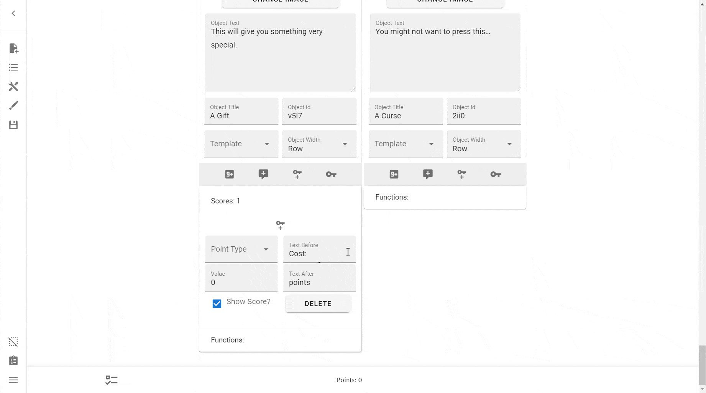

#### Value
The **Value** field tells the program how many points to take away or give.

See how to [add](#adding-points) and [subtract points](#subtracting-points) 
below.

#### Text Before
The **Text Before** field tells the program what text should be before the
value.

!!! tip

    Change this to something like "Gain:" or "Gives:" when adding points,
    unless you're indicating whether with a plus or minus sign, in which case
    it's optional.

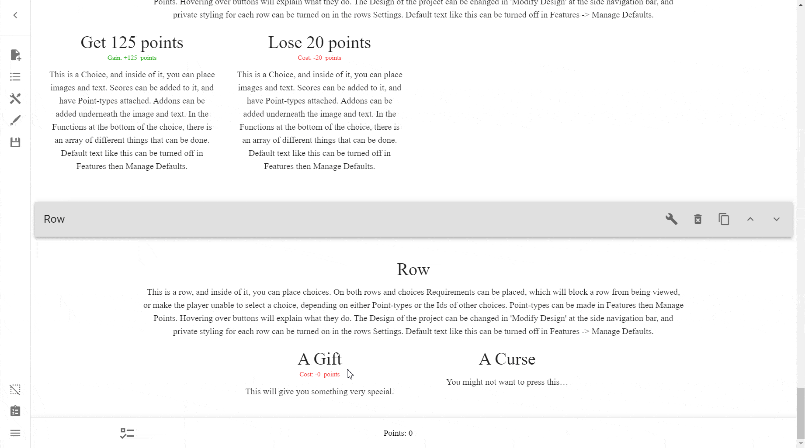

#### Text After
The **Text After** field, much like the **Text Before** one, shows what is
displayed *after* the text.

!!! tip

    You should change this according to the Point Type name, e.g. "points" →
    "shard points" or "mana" etc.

#### Show Score?
Normally on by default, this switch allows you to hide what points may be
added or subtracted. This can be useful if you had hidden mechanics that aren't
relevant to the end-user, or if you had an image that shows how many points it
costs already.

=== "Checked (Default)"

    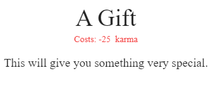

=== "Unchecked"

    

### Subtracting Points
In order to subtract from a Point type, simply type a positive integer into
the Value field.

E.g. `10` subtracts 10 points.

### Adding Points
In order to add to a Point Type, simply type a negative integer into the Value
field.

E.g. `-25` adds 25 points.

!!! question "Why negative numbers?"

    As subtracting is the default behaviour, and there is actually no in-built
    method of adding, creators have to hack the ICC by using the mathematic
    rule that subtracting a negative produces a positive.

---

Learn more what you can do with Points and Scores in the [Reference].

<!-- URLs -->
[the Sidebar]: ../../basics/#the-sidebar
[ids]: ../ids-and-requirements/
[choice]: ../objects/
[Reference]: /appendix/reference/#points-and-scores