# Rows
The basic building block of Interactive CYOAs made with this creator is the 
Row. Rows are not only the sections that divide the CYOA up, but it is only 
attached to a Row where Objects can exist. 

## Creating Rows
Create a Row by opening up the sidebar and pressing _Create New Row_.

## Cloning Rows
!!! note ""

    { align=left }
    To clone or copy a Row, press this button.

    Cloning rows can be useful when you have [private styling] or a specific
    set of choices you need to repeat. 

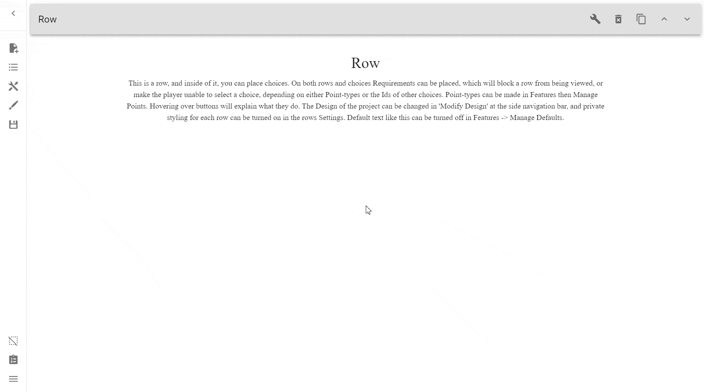

## Deleting Rows
!!! note ""

    { align=left }

    To delete a Row, press this button, and then _OK_.

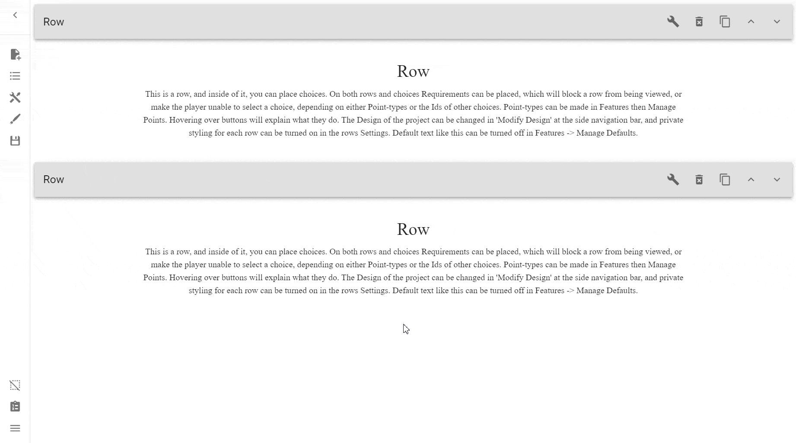

## Editing a Row
!!! note ""

    { align=left }
    To edit a row, press the wrench/spanner icon.

    This will open the edit menu for the row. 

## Row Title
By default, the row title will be **Row**.

As Rows are generally sections (such as Powers, Perks, Drawbacks, etc), you 
should name your Row after what the Objects represent.

To edit the Row Title, simply edit the text in the **Row Title** section.

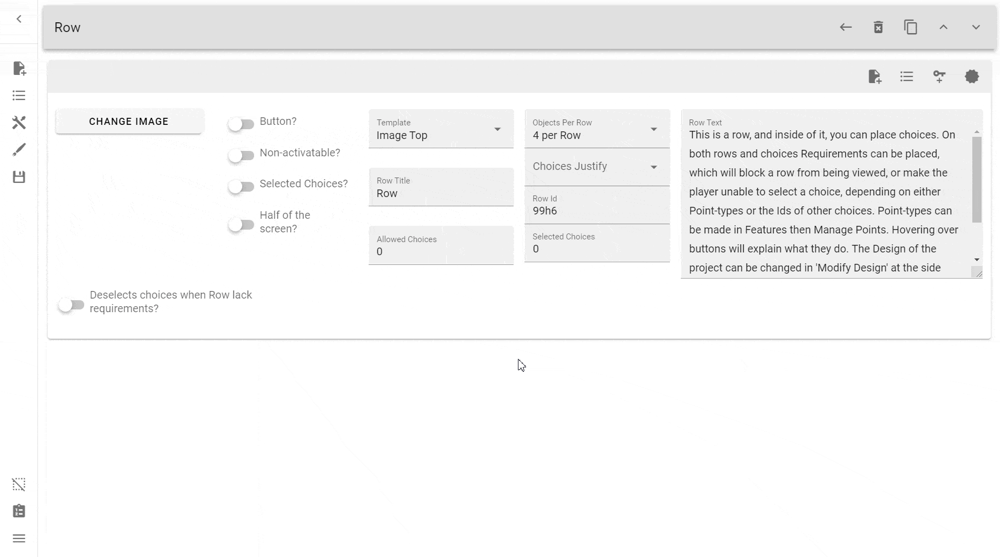

## Row Text
Row Text can be used to provide a description of the section.

You can also use it to provide notes specific to the section in particular,
such as informing the players that they can select only 1 option.

To edit the row text, simply edit the text in the **Row Text** section.

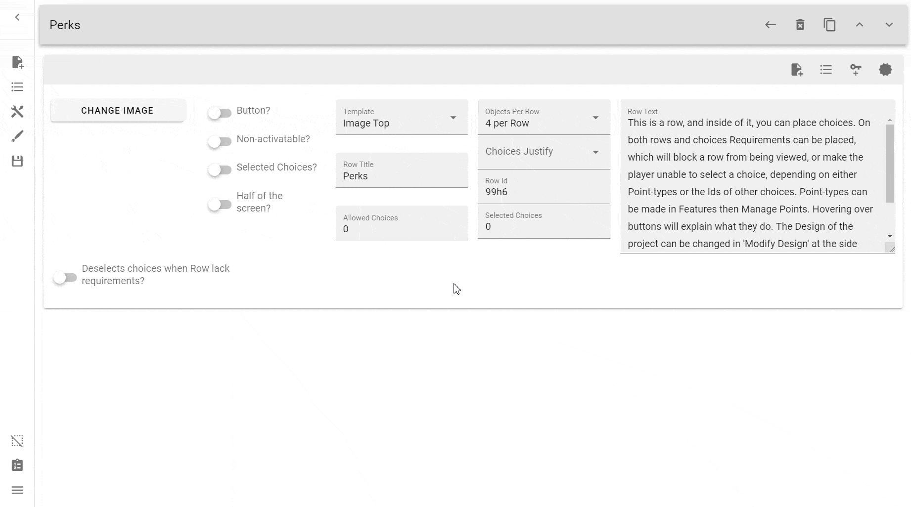

## Allowed Choices
The _Allowed Choices_ options allows you to restrict the amount of choices a 
player can pick in that row. It takes a non-negative integer (anything above
zero).

If you want ANY number of options with no limits, simply put 0 into the field.

This is used for sections where you might say "You may only take X options".

There will be a way to dynamically change this amount, but we’ll come back to 
that later (to skip ahead, see [here][dynamic_allowed_choices]).

---

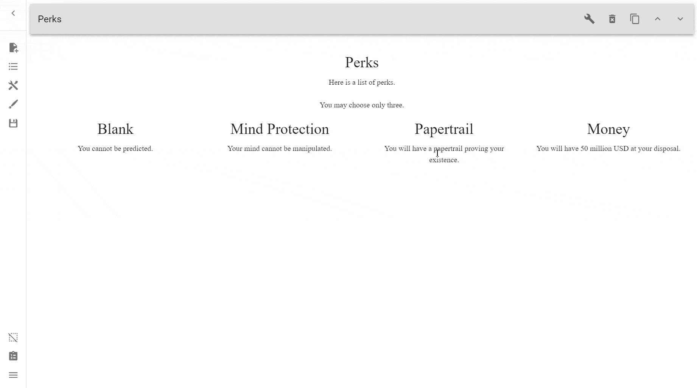

## Selected Choices (Input)
The _Selected Choices_ field will show how many choices are currently selected,
and should normally be 0. An exception would be choices that are selected by
default.

!!! danger

    **You should not change this value unless you know what you're doing.**

If it is something other than 0 and no choices are selected, then something has
gone wrong. You can fix this by changing the value to 0.

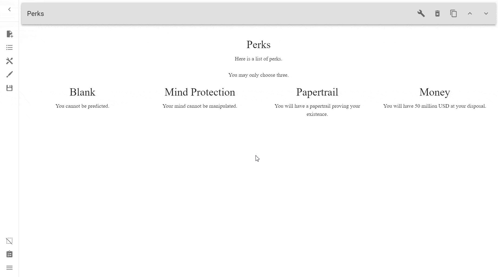

## Objects Per Row
The _Objects Per Row_ option allows you to specify how many Objects should be
present within an Object row.

=== "1 per Row"

    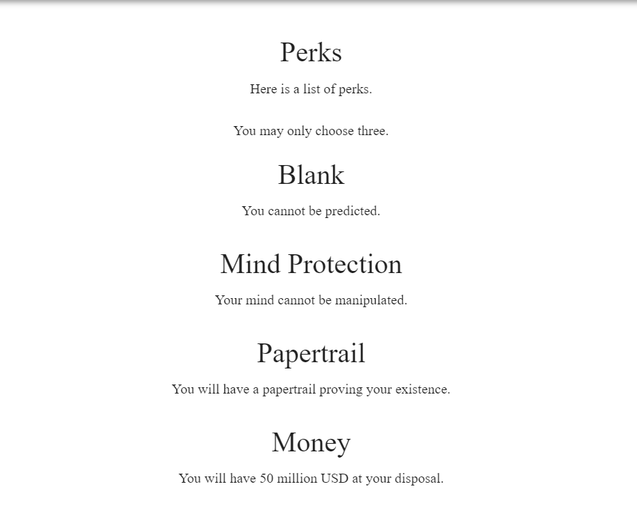

=== "3 per Row"

    

=== "4 per Row"

    

### 'Row' Objects per Row
!!! note

    This section may get confusing for beginners, so feel free to skip ahead
    if you don't understand it.

    _Objects per Row_ – This is set within a Row's options

    _Object Width_ – This is set within an Object's options

Most **Objects per Row** options seem pretty straightforward, but this one in 
particular might get confusing. It is in fact not used by a Row (though
the option is bafflingly there), but is instead used for individual Objects'
**Object Width**.

To give context, individual Objects of a specific Object row (not referring to
the Row object, but an actual row—as opposed to column—of Objects) can set a 
custom **Object Width**, allowing further customization and deviance from a 
Row's **Object per Row** setting.

* For example, you can have one row have two Objects take up an entire row by
setting both of their **Object Widths** to **2 per Row**, and the next row
could have five Objects take up the entire row by setting their
**Object Widths** to **5 per Row**.

Objects have an **Object Width** of **Row** by default, and that means that 
their width is equal to whatever is set by the **Objects per Row** setting. 
This is convenient in that you don't need to go into each and every choice 
width and update it, instead only updating the **Objects per Row** once.

If you have changed an individual Object's **Object Width**, then setting back
to **Row** resets it back to the default width.

## Non-Activatable?
This option can be used when you just want to supply information using Objects 
and don’t want those Objects to be selectable.

Objects are great for this because they allow you to split information into 
chunks, each with an image being able to be attatched.

!!! quote "Help and Instructions"

    The third button will make it impossible for a player to change any of the
    choices, if one is selected then it will stay selected and vice versa. Good
    to use when the user should be given information or story, and not choices.

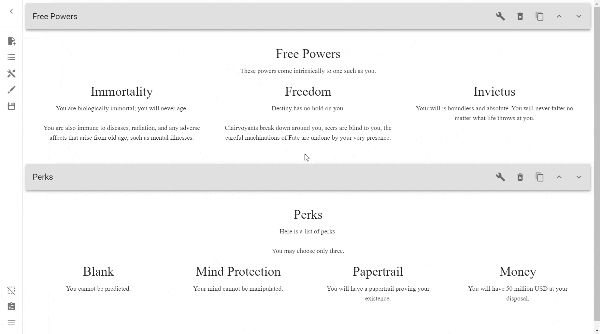

## Selected Choices? (Switch)
The **Selected Choices?** switch enables a whole host of other options that 
have to do with the Objects in the Row.

Options here can do two things:

1. They display choices you've already selected, and
2. They can change something about all Objects in the Row

!!! quote "Help and Instructions"

    The middle button named 'Selected Choices?' can be used to make the row 
    show all choices that have been selected, good to use at the end of the 
    project to let the player see the choices they have made. A private row 
    design should be used to make filters invisible.

By default a Row with this on will collect all choices that are selected.
You can use the below switch to filter this into only the Objects from the Row
you want Alternatively, if you don't make a group by Row, and instead
_Add To Group_ on Objects manually, you can further refine your selection.

### Selected Choices from Group Id
The _Selected Choices from Group Id_ switch displays selected choices, but only
if they are a part of the same Group.

!!! note

    * Rows can be a part of as many Groups as you want
    * You can select multiple Groups for this option

Although the _Process_ tab shows how to set up a Group for this demonstration, 
it is not fully detailed. In-depth detail on Groups is provided [here][groups]. 

=== "Result"

    

=== "Process"

    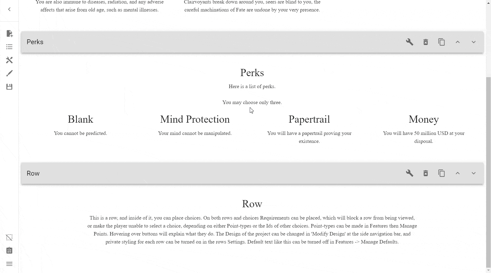

### Choices will all be 'Template Top' and Row Width
This will set it so that each choice that appears in a _Selected Choices_ Row
will be normalized. Every image will be at the very top, and it will have Row
Width by default (see [here][row_width] for an in-depth discussion on that).

=== "On"

    

=== "Off"

    

### Remove the text of the choices
This will, as it explains, remove the body text/description from choices,
leaving only the title and images.

!!! warning

    It is advisable that you also select
    **Choices will all be 'Template Top' and Row Width** as well, since this
    option will only remove the text of choices that have an image at the top.

=== "Normalized Images"

    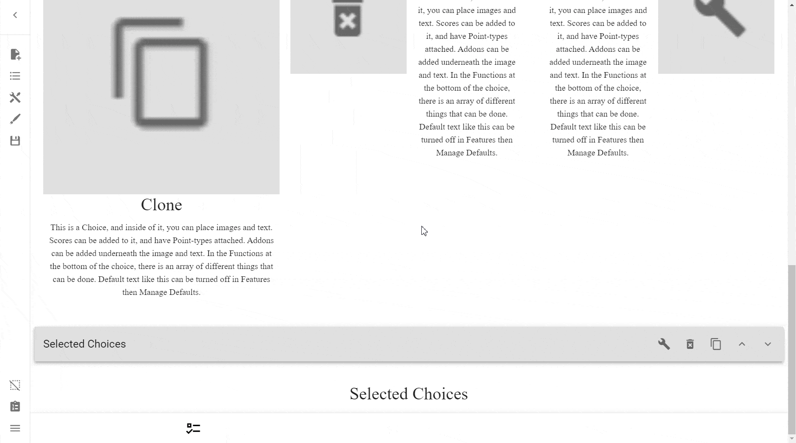

=== "Default"

    

### Show the title of the row in the choice.
Another self-explanatory one, it will display the title of the Row above the
choice's title. This is quite useful in cases where you have a list of choices
that occur from more than one section, so that you can tell choices apart.

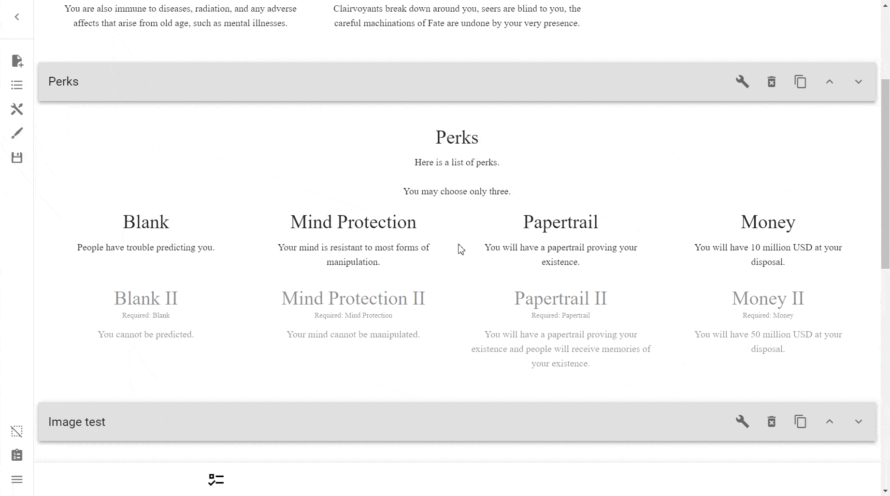

## Half of the Screen?
This switch will allow you to have two Rows, each on one half of the screen.
This option can be quite useful.

## Deselect choices when Row lacks requirements?
This switch deselects all the selected choices if the Row itself lacks
requirements (and thus is most likely invisible).

If this option is off, then selected choices are preserved.

=== "Deselect on"

    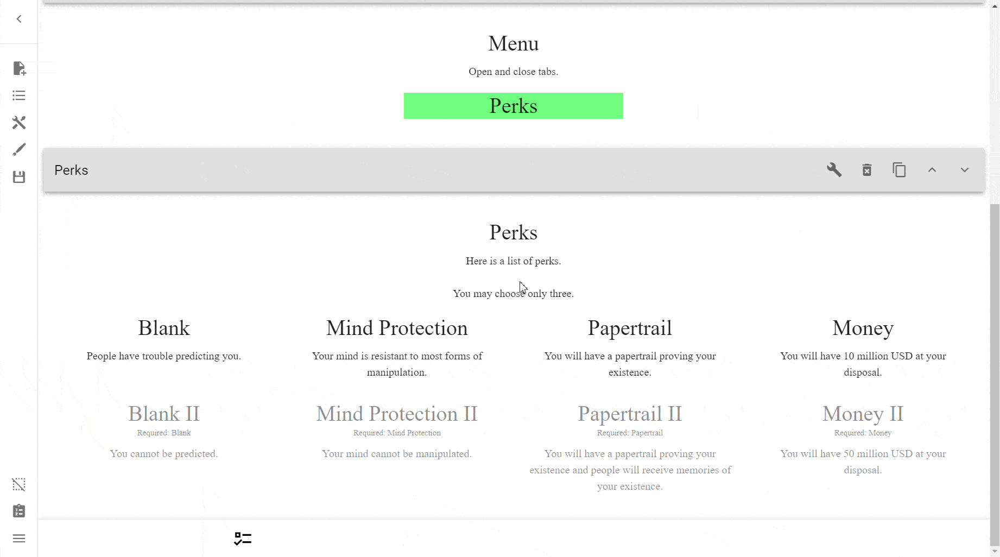

=== "Default behaviour"

    

## Row List (Side Menu)
See [here](../../introduction/#open-row-list).

## Sort The Choices In The Row (Row Settings)
This option allows you to change the order of the choices within the Row. This
can be quite a useful option. It is found within the Row's settings.

Open Row Settings → Choose an option for sorting → Press 'Sort'.

The options are:

* Object Width - Biggest to Smallest.
* Object Width - Smallest to Biggest.
* Text Length - Longest to Shortest.
* Text Length - Shortest to Longest.

**Object Width** sorts by how much space in a row Objects take, whereas
**Text Length** sorts by how much text is within the **Object Text** field.

[private styling]: ../../styling/#private-styling
[dynamic_allowed_choices]: ../objects/#adds-or-takes-away-a-rows-allowed-choices
[groups]: ../../mechanics/groups/
[row_width]: ./#row-objects-per-row