# Publishing on GitHub
What is GitHub? GitHub is primarily a place to store code in "repositories".
Repositories (or repos for short) are essentially folders, where each folder is
a project for one or more applications, libraries, or something else.

Luckily for us, code includes the Viewer and the `project.json`! Using GitHub
is good because there is no limit to the amount of repositories you can create,
and they are very generous with storage space, allocating it *per repo* rather
than *per account*.

## Limits
GitHub has these limits:

* A recommended limit of 1 GB per repository
* A *soft* bandwidth limit of 100 GB per month
* A *soft* build limit of 10 builds per hour, if using the default GitHub Pages
(Jekyll), rather than a custom GitHub actions workflow (like Static HTML)
* You are only allowed one account, *but* you can create unlimited
  repositories, hosting an unlimited amount of 1 GB subfolders under your
  custom domain.
* Repos must be public to use GitHub pages (this is fine because project.json
  files are stored in plaintext anyway)

See [here][github-usage-limits] for more info.

## Creating an account
To create an account, first go to the site here: [https://github.com/][gh]

[gh]: https://github.com/

That should bring you to this page:


Press the **Sign up** button in the top right and sign up like you usually
would!

You should land on this page now:


## Using a Template
I've made a nifty GitHub template that comes pre-packaged with:

1. Hyperlinks enabled
2. IntCyoaEnhancer's Download Progress Indicator
3. Optional CSS code in the `index.html` to:
    * Make your backgrounds static
    * Change the colour of your Point Bar icons
    * Override the background image in the `project.json`
4. An automatic GitHub workflow to republish your site on any change

It's located ==[here](https://github.com/upasadena/intcyoa-gh-template/)==.
Text instructions are included in that repository, or you can watch the video
below for a short 2 minute tutorial on how to host on GitHub:

{{ youtube_embed("LCvOVB8wZQE") }}

## Creating a repo
If you didn't want to [use the template](#using-a-template) you can instead set
up your repository manually. This will show how to do so.

You can create a repo in two ways, by pressing the green **New** button on the
top left, or expanding the ++plus++ button on the top right, and pressing
**New repository**.


This should open up this form:


### Repository name
This option is how you select the name of your project. I would recommend
naming this after your cyoa, completely lowercase and with dashes instead of
spaces (spaces will automatically be converted to dashes by GitHub).

!!! tip

    I would recommend creating a new repository for each CYOA (at least, if it
    becomes too big). This is because some CYOAs can get incredibly big (JRPG
    Traitor is 363 MB even with compression), and having multiple huge projects
    in one repo can cause problems, such as longer waiting times for the site
    to deploy.

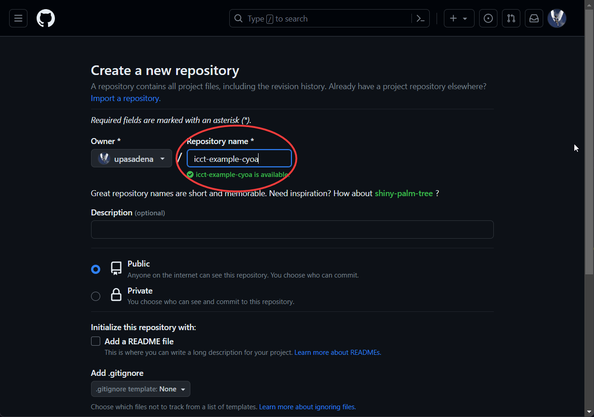

### Description
As this says, it is optional. It shows to you and anyone viewing your GitHub a
short summary of what it's about.

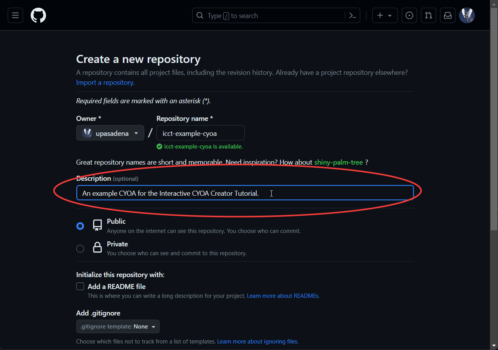

### Public or Private
Keep this on Public if you're a Free user. Free users cannot host Private
repositories (though they can still use them).

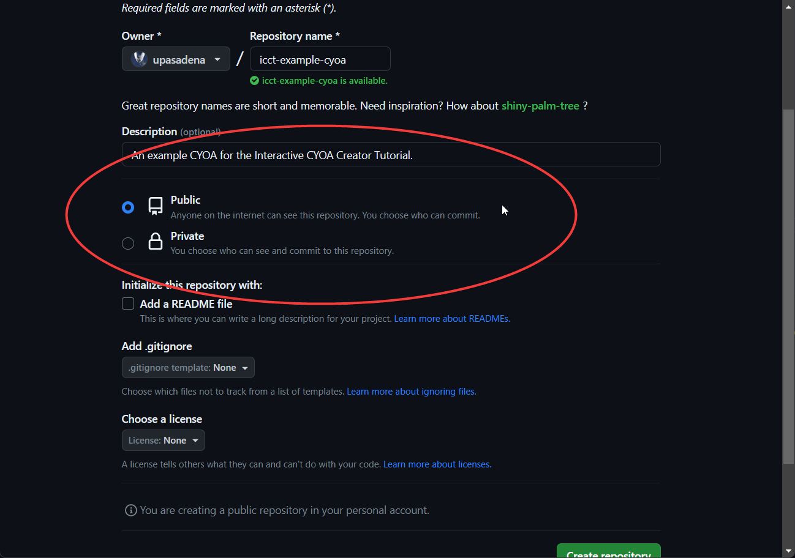

### Initialize this repository with
This just adds useful files on creation of the repo.

#### Add a README file
A README file is a file that contains useful information about a directory and
its contents therein. When viewing a repository's code, a `README.md` (the md
meaning Markdown, the markup language that this tutorial is written in) is
prettily displayed at the bottom.

I recommend checking this option if you haven't already created a local git
repository, as it allows you to give information on the CYOA.


As an example, here is what the `README.md` of this tutorial looks like:

=== "Repository"

    !!! example ""

        

=== "Code"

    !!! example ""

        

Learn more about READMEs from GitHub [here][gh-readme].

Learn Markdown in a matter of minutes [here](https://commonmark.org/help/).

!!! info

    Fun fact, if you know how to bold and italicize text in Discord, you
    already know [a flavour of Markdown][discord-md].

!!! info

    You can view the Markdown source for this page (and all pages in this
    tutorial) by going back to the top and pressing the page icon with the eye:

    !!! example ""

        

    Which will take you to this:

    !!! example ""
    
        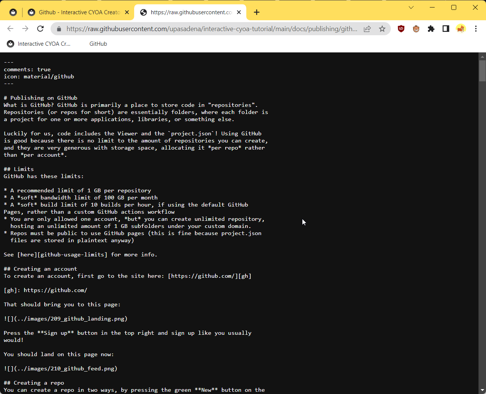

    You can also press the edit button in order to edit, but it's not likely
    you have write permissions to the repository, so you will have to fork
    (essentially copy) the repository, make your changes, and do a pull request
    (requesting that your code is merged back into the main repository).

#### Add .gitignore
You can, heh, ignore this. We won't need a `.gitignore` for the purposes of
this tutorial, so just leave it at **None**.

!!! question "What is a .gitignore used for?"

    Some programming languages and tools, when building applications leave
    residual files and folders laying about, and people may have database
    passwords and API keys and secrets in files.
    
    A `.gitignore` file is used to ignore uploading them so that the developers
    don't accidentally leak their information or upload files that aren't
    necessary to running the application.

!!! danger

    A .gitignore is only used when using [Git CLI](#git-cli). If you upload
    files from the web, **you can upload unwanted files**.

#### Choose a license
As GitHub says,

> A license tells others what they can and can't do with your code.

If you wanted to control how others use your `project.json` (because no one but
MeanDelay has the rights to the Viewer), you can do so using a Licence here.

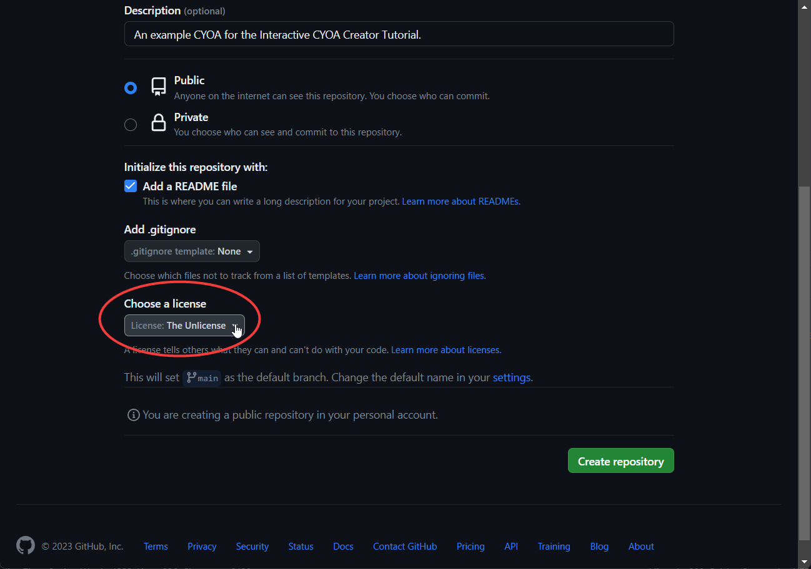

A couple of common licences include:

For source code (such as the `README.md` and `project.json`):

* [MIT](https://choosealicense.com/licenses/mit/) – You can do anything with it
  but you have to credit me (by including the licence), and I am not
  responsible for what you do with it
* [AGPLv3](https://choosealicense.com/licenses/agpl-3.0/) – You can do anything
  with it but:
    * You have to make it open-source (such as uploading it publicly on
      GitHub) if you're distributing it
    * You have to include this licence, including copyright notices
    * Serving this over the internet counts as distribution
    * You have to use this licence too
    * You have to state your changes
    * I am not responsible for what you do with it

For content (such as for making a static CYOA or original content inside of the
`project.json`):

* [CC BY](https://creativecommons.org/licenses/by/4.0/) – You can do anything,
  but you must credit me
* [CC BY-SA](https://creativecommons.org/licenses/by-sa/4.0/) – You can do
  anything, but:
    * You must credit me, and
    * You must use this licence for any derivative works
* [CC BY-NC](https://creativecommons.org/licenses/by-nc/4.0) – You can do
  anything, but:
    * You must credit me, and
    * You cannot use the material commercially
* [CC0] – This work is dedicated to the public domain, you can do anything with
  it!
    * An equivalent for source code is [The Unlicense].

[The Unlicense]: https://choosealicense.com/licenses/unlicense/
[CC0]: https://creativecommons.org/publicdomain/zero/1.0/

!!! info

    Fun fact, the AGPLv3 is the licence that this tutorial is using for its
    source code. For its content, it is licensed under [CC0], a dedication to
    the public domain!

Learn about more licences [here][gh-licences].

---

Overall, this only matters if you expect others may want to create derivative
CYOAs (such as how Lt Ouroumov's Worm CYOA V6 is a fork of PixelGMS's
original).

Additionally, it's a bit of a legal grey area considering you could potentially
be hosting copyrighted content such as images and text (if you're adapting
someone else's CYOA). To play it safe, you can:

* [Attribute images to their authors][image-credit] (asking for permission may
  not be tenable if the project is large enough or if the authors don't
  respond)
* Ask for permission from whoever made the original static, and
* Write in your `README.md` that you are only licensing the unique content in
  the `project.json`, such as the Mechanics, Styling, etc

[image-credit]: /mechanics/images/#tooltip-that-shows-when-hovering-over-it

### Creating the repo
To actually create the repo now, press the **Create repository** button.


You should now have made a repository!

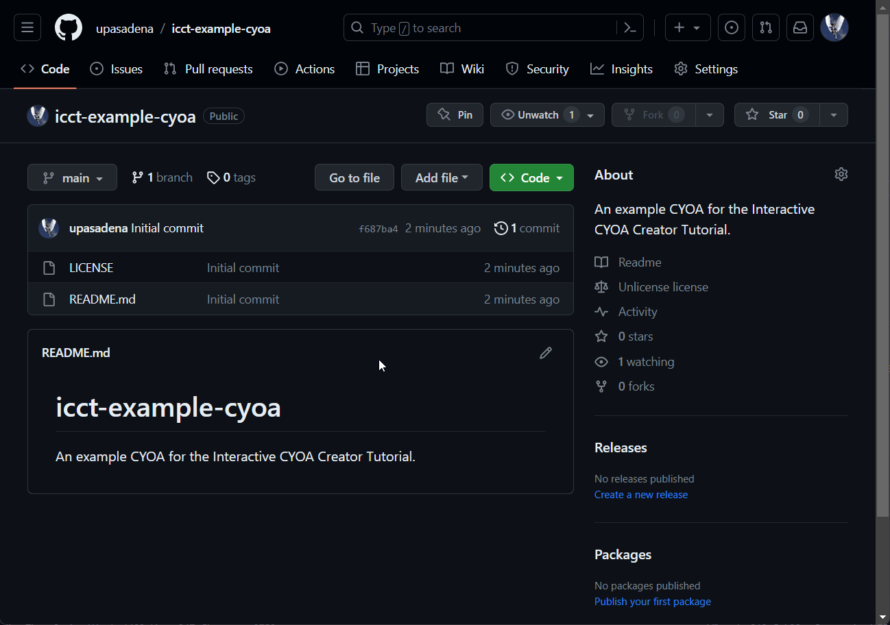

## Uploading files
To upload files is easy, simply press the **Add file** dropdown menu, and
select **Upload files**.

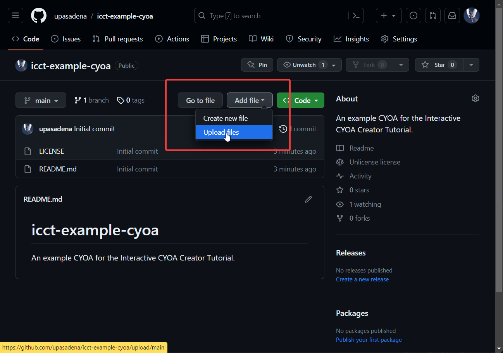

!!! note

    You cannot upload empty directories, you must have a file inside of them.

To upload your site, simply upload the Viewer files and your `project.json`!

!!! tip

    Try dragging and dropping rather than choosing your files. I've had
    problems with uploading folders using that method.

!!! example ""

    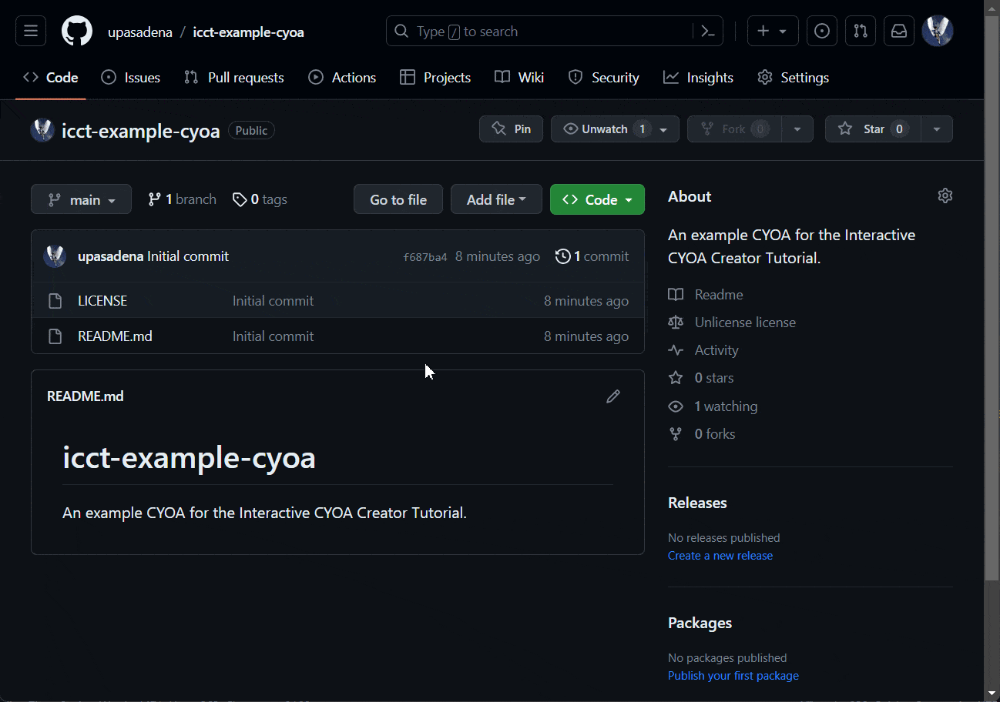

## Publishing to GitHub pages
Now that your site is uploaded, it's time to publish it for the world to see!

There are two methods we will be using in this tutorial: Jekyll and Static
HTML. There are pros and cons to both:

| Method          | Pros                                                               | Cons                                                                                | Use case                                                                                                               |
| --------------- | ------------------------------------------------------------------ | ----------------------------------------------------------------------------------- | ---------------------------------------------------------------------------------------------------------------------- |
| **Jekyll**      | + Allows using Markdown (.md) files<br/>+ Jekyll themes<br/>+ Easy | - Slower to deploy<br/>- Can be bloat if you don't need it                          | If you want to host information alongside CYOAs, such as Changelogs or a Version select, or if you have multiple CYOAs |
| **Static HTML** | + Faster to deploy and lightweight                                 | - To display information you will need to use HTML and CSS<br/>- Needs to be set up | If you want to simply host CYOAs and that's it                                                                         |

### Using Jekyll
This is the default action that GitHub uses, and it's very easy to set up.

Simply go into **Settings** → **Code and Automation/Pages** → **Branch** →
Change _None_ to _main_ → **Save**.

This will start the build process.

!!! example ""

    

Going back to your repository you should see an orange icon, this indicates
that GitHub Actions is working in the background to publish the site.


Pressing on that icon gives you an overview of its status:


And pressing details should give you even _more_ details:

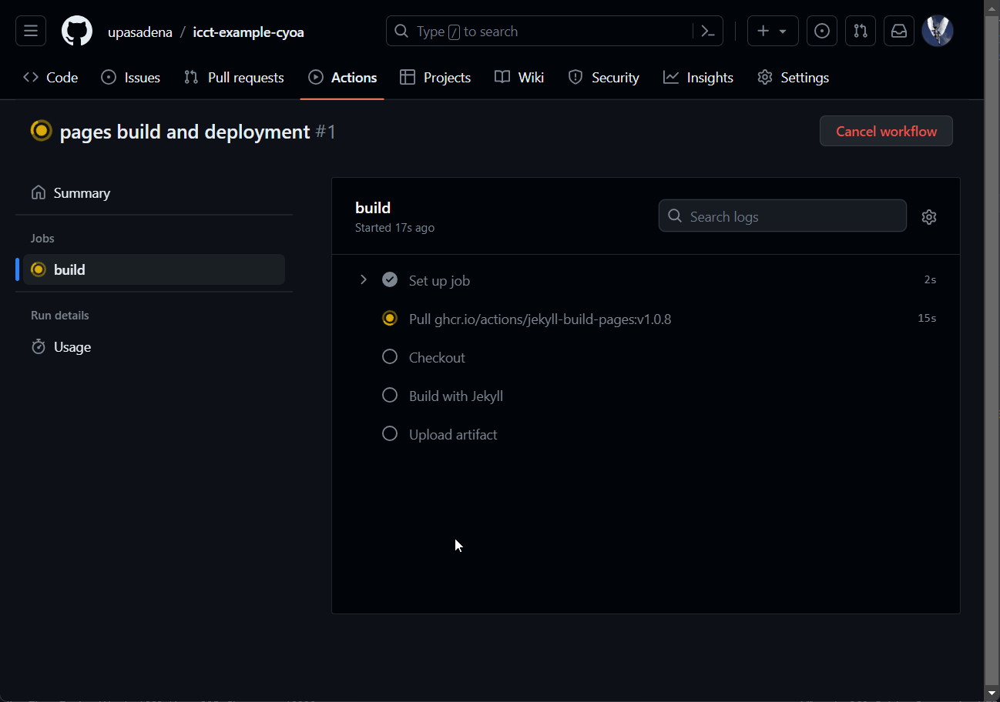

After some time, it will complete:


You should be able to access your CYOA at
`https://your-user-name.github.io/your-repo-name/` now!


You can repeat this with each and every CYOA you've made, and they will all be
available under the subfolders of your special custom domain!

This example will always be available at
[https://upasadena.github.io/icct-example-cyoa/][icct-ex-cyoa].

[icct-ex-cyoa]: https://upasadena.github.io/icct-example-cyoa/

If you want a quick way to get your link, see
[Adding a link to your project](#adding-a-link-to-your-project) down below.

### Using Static HTML
If you didn't want to use Jekyll and just wanted to serve the files as-is, this
is the option for you!

To start with, go into the Pages menu in the Settings. Select the **Source**
dropdown menu and select **GitHub Actions**.


You should see two suggestions workflows now. Select **Configure** under
**Static HTML**:

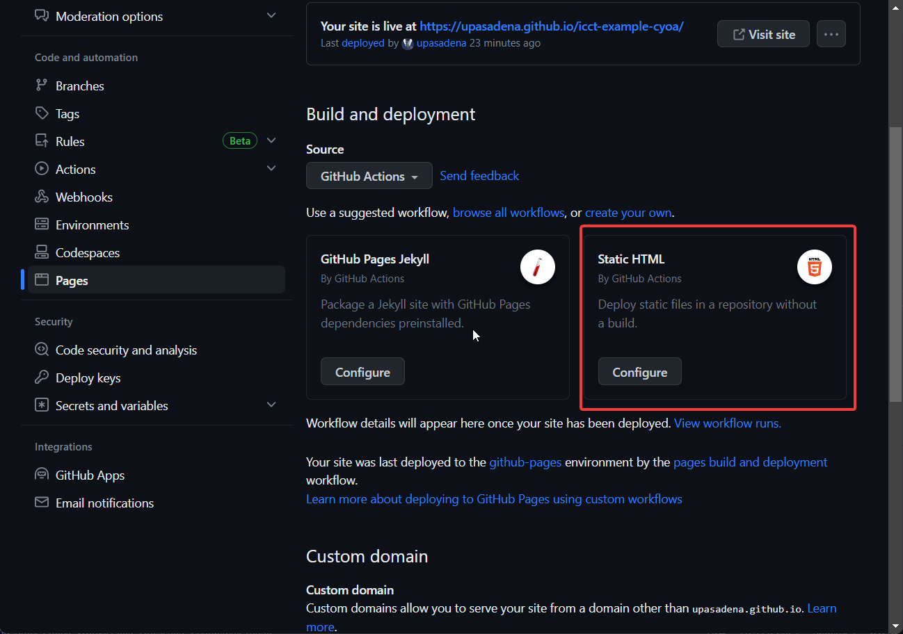

Then save the file by committing your changes (green button up at the top
right).

!!! note

    If it's not there:

    1. Copy and paste the code from [/static/static.yml](/static/static.yml).
    2. Then, put it in a file under `.github/workflows/static.yml`.
       * You can do this straight from the browser by selecting **Add file** →
       **Create new file** from your repository root. Where it says to name
       your file up the top, pressing slashes will create folders for you if
       they don't exist, so simply copy and paste the above path and file.
    3. Save the file by committing your changes (green button up at the top
       right).

You should notice it is rebuilding now, and you have a new `.github` folder:


As you can see here, there *is* a performance difference, even for such a small
repository, so you can be rest assured if you have a massive one, then swapping
over to _Static HTML_ will improve the deployment times. This is useful if you
want to send out updates to your audience quickly.

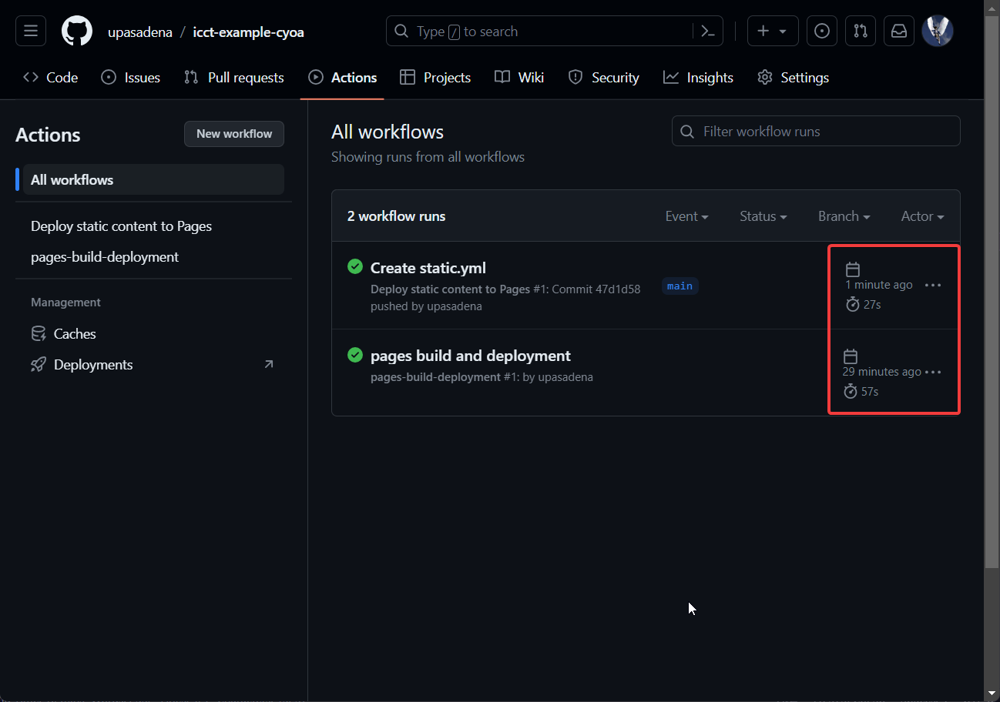

!!! question "Why does Jekyll take longer?"

    This is because Jekyll is an external framework that takes in Markdown
    files and outputs them to HTML. So GitHub Actions has to not only download
    and install Jekyll AND your Git repository, but it must then convert any
    Markdown files to HTML.

    Whereas _Static HTML_ simply just uploads your files to a web server, and
    serves them as-is, making the progress significantly faster.

### Adding a link to your project
If you want to quickly get the link to your site and have it ready to press in
your repo, you'll want to do this. This is especially useful for newcomers who
may want to preview your site, but don't have the time to host it themselves.

Simply press the settings icon in the top right (but NOT the settings tab, a
bit below that, to the right of About) → and tick
**Use your GitHub Pages website**.

You can also manually input a website in the Website input field if you were
hosting elsewhere.


!!! example

    

## Unpublishing your site
If you ever need to take down the site for some reason, it's simple!

Navigate to Pages in the settings, press the three buttons where it says your
site is live, and press **Unpublish site**.

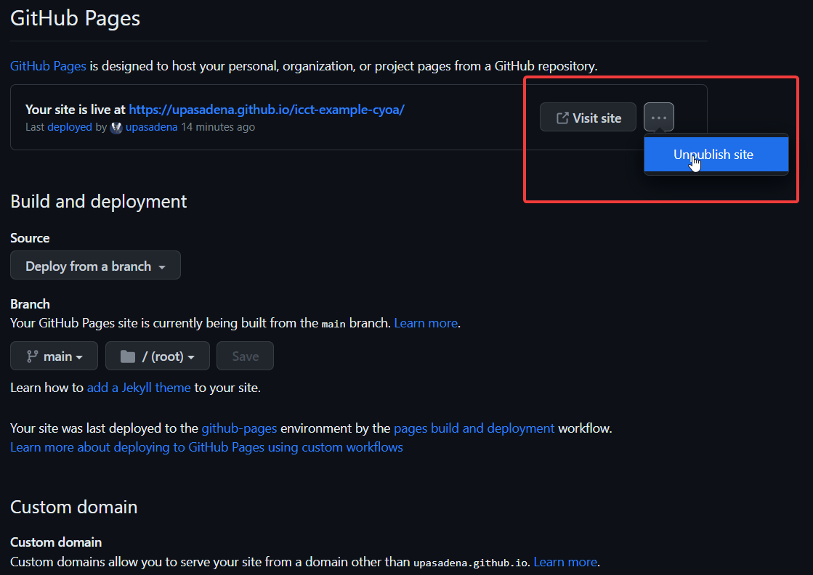

But your repo is still accessible to the public. You can either:

* Make it private
* Delete it, or
* Do nothing, I just want to unpublish the site only

## Configuring your root site
If you wanted to configure the very root of your site (Such as
`https://yourname.github.io/`) then it's simple. Just create a repository
called `yourname.github.io`, and activate Pages for that.

---

Learn more about GitHub Pages [here][gh-pages]

## Releases
Releases are, you guessed it, releases. Specifically, they snapshot a version
of your project that then becomes immutable, meaning you cannot change it.

They are significant because they allow you to go back to an earlier point at
view what it was like then, and, because Releases automatically create tags,
you can compare using `git diff` the difference between the two releases: what
changed, what was deleted, and what was added.

You can create "releases" by pressing **Create new release** in the bottom
right, under the **Releases** header.

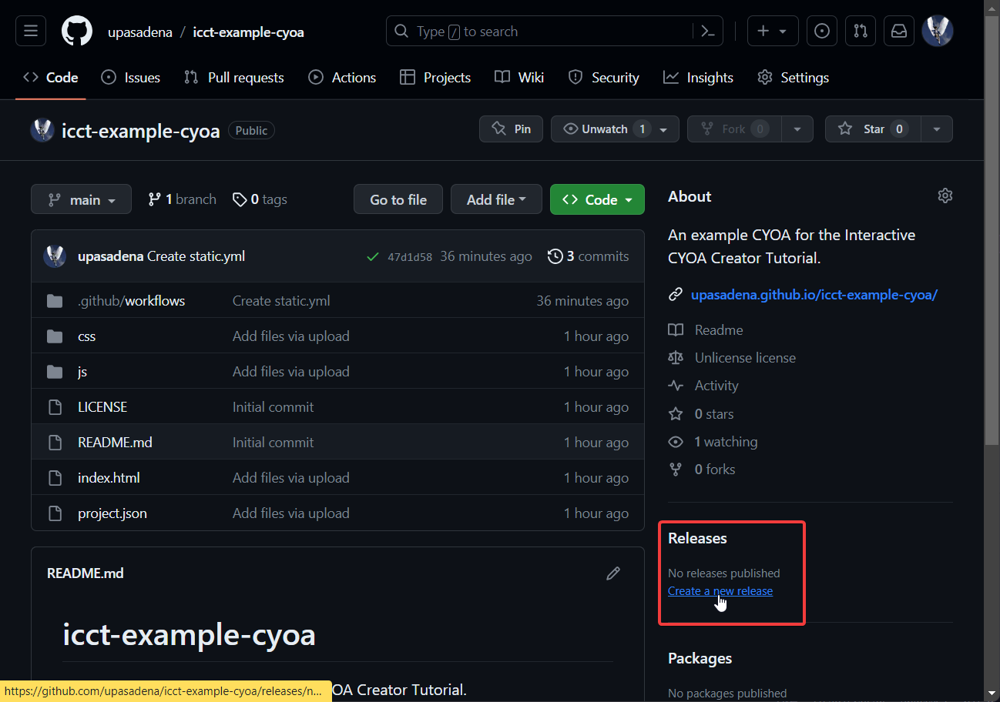

## Git CLI
!!! note

    This topic is for more intermediate to advanced users. It may not be
    necessary for your use case.

    This section assumes basic familiarity with commands like `mkdir` and `cd`.

    This is not the _best_ tutorial on Git out there, and won't be covering it
    in much detail, just enough to do basic stuff like cloning and uploading.

Git is an incredibly tool that is vast and complex. As such, it is simply
untenable to go through each and every aspect of it. Instead, we will go
through the very basics in order to get you up and running.

!!! note

    Git is where GitHub gets its name, because it's a hub for Git repositories.

To begin, download the tool from [here](https://git-scm.com/downloads) (if
you're on Windows or Mac; if you're on Linux install using your package
manager).

After installing, make sure it is in your path by running (in Windows, this can
be Powershell or Command Prompt, which you can open by searching for it, or by
pressing ++win++ + ++r++ then typing `cmd` or `pwsh`. If you're on Linux you
already know what terminal emulator you're using.):

```sh
git --version
```

where it should display like so:

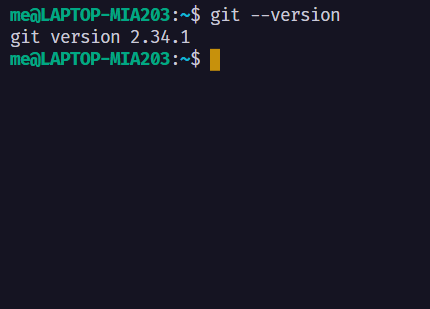

### Initializing a repository
!!! note

    Use this only if you **haven't** created a GitHub repository and selected
    an option under "Initialize this repository with".

Use the command in the folder you want to initialize:

```sh
git init
```

or to initialize it outside of the folder:

```sh
git init my-interactive/
```

This display "Initialized empty Git repository" when completed:


And you may notice a hint here if this is your first time using Git. Git
repositories can have many "branches", which can be thought of as a branch of a
tree. They can split off at any time (and thus are separate) but – unlike real
trees, I assume – can also rejoin the original branch, merging them together.

The default branch that Git starts with is `master`. However, the default
branch that GitHub uses is `main`. I recommend changing it to `main`:

```sh
git config --global init.defaultBranch main
```

You may have noticed `#!sh --global`. There are two levels to Git config
settings. There are the global settings, which are the default for each project
you use, and repo-specific settings, which override the global ones. So an
existing repo using `master` as the main branch will not be overridden by your
default, and you can rest assured.

As it says, to rename your current branch use:

```sh
git branch -m main
```

### Changing the config
Git needs a name and an email in order to `commit`. Set this up globally like
so:

```sh
git config --global user.name "Pasadena"
git config --global user.email "underscore.pasadena@gmail.com"
```

Remove the global flag for repository-only settings. You can see the current
values by simply not typing anything after `user.name` or `user.email`.

!!! tip

    Set the name and email to your display name and email used by GitHub,
    respectively. This is because GitHub will display the account associated
    with the email's name and profile picture, and links to that account too.

### Tracking files
To first do something with Git, you must have files.

Let's create a file right now:

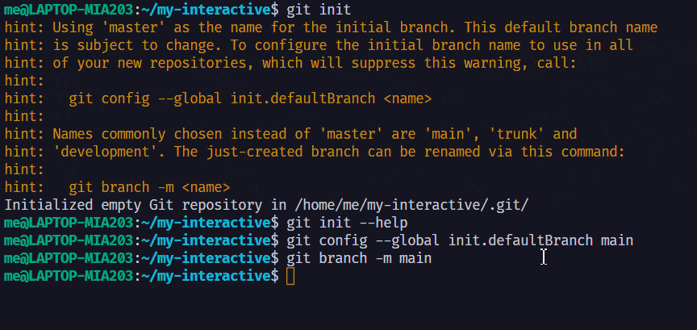

Now let's track the status of our Git repository:

```sh
git status
```

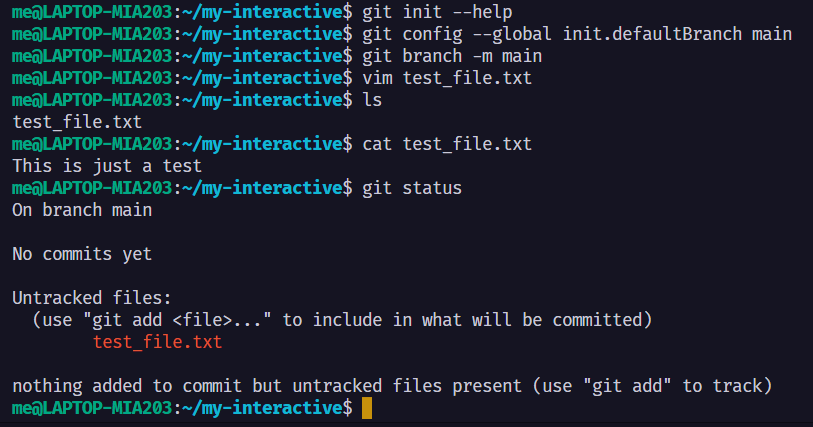

As you can see, it knows the file exists, but it is untracked. That means Git
will ignore that file.

To individually add the file into the Git repository:

```sh
git add test_file.txt
```

To add **all** files in the current folder recursively, do:

```sh
git add .
```

Now let's check the `#!sh git status` again:


Great! The changes made (a new file in the directory) are now ready to be
committed.

But what if you want to exclude files from being included (especially useful if
you're using `#!sh git add .`)? If you read the earlier sections, you know
about the `.gitignore` file. Creating this and setting rules allows you to
ignore files and folders according to patterns. Here are some basic patterns:

```gitignore
# This is a comment, it will be ignored, and is used to document what a
# specific thing does

# Ignoring single files
example.txt

# Keeping single files
!example.txt

# Multiple files of the same extension
*.txt

# Multiple files of the same name
example*

# Folders
examples/

# Files inside of folders
examples/example.txt

# Ignoring files in every directory
**/example.txt
```

See more information at this cheat sheet
[here](https://github.com/kenmueller/gitignore).

### Making a commit
A "commit" is essentially a mini-release. It is you stating that all changes to
the repository have been finished, and to officially register all the
cumulative changes in the Git repository. Commits only affect tracked files.

To make a commit you must use the `#!sh git commit` command:

```sh
git commit -m "Your message here!"
```

The `-m` flag (short for `message`) is where you put information about what you
changed. GitHub has the message of the very first commit be `Initial commit`,
and has changes to files by default be `Update <file name>`. The important
thing is to be consistent with this.

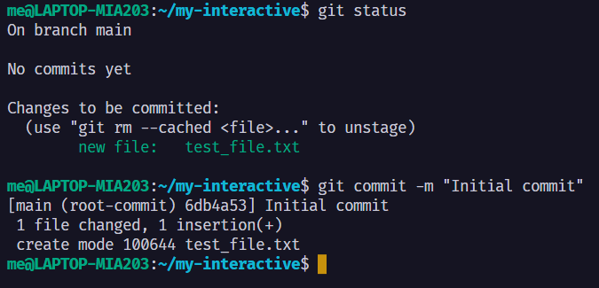

And you just made your first commit!

### Viewing the log
You may wish to view the commit history at one point.

To do so, simply type:

```sh
git log
```

And it will display lots of information:

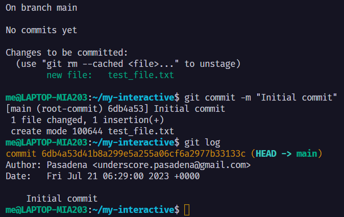

For now, it's pretty sparse. But come more commits you'll be able to see more
and more.

To view it in a more compact manner, simply type:

```sh
git log --oneline
```

to get this:

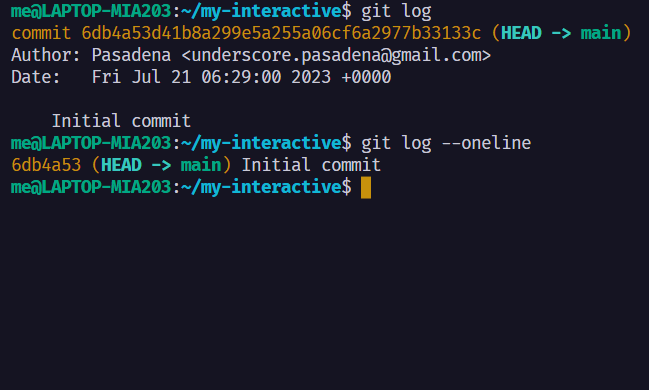

### Downloading a repository
Whether you're downloading someone else's repo or your own, the process is the
same.

Simply use the `clone` subcommand:

```sh
git clone <URL>
```

For example, this will clone the repository of this tutorial (warning: this
tutorial is 324 MB as of v0.15.0):

```sh
git clone https://github.com/upasadena/interactive-cyoa-tutorial
```

which will look like this when done:


Using Git clone is important, because it preserves the Git repository. Other
methods of downloading may only download the files themselves, rather than with
the Git repository.

### Uploading to GitHub
Now, we'll be assuming that the repository we're uploading to hasn't been
initialized yet, and so is empty. If it already has been initialized,
[clone](#downloading-a-repository) it, make your changes, commit, then jump to
[#pushing](#pushing).

#### Setting up the remote
In order to upload your files to the cloud, Git must first know where it
resides. To that end, use the `#!sh git remote add` command:

```sh
git remote add origin https://github.com/YOUR-USERNAME/YOUR-REPOSITORY-NAME.git
```
After making an empty repository called `git-cli-tut` on GitHub, I added it
like so:

```sh
git remote add origin https://github.com/upasadena/git-cli-tut.git
```

!!! example ""

    

Now Git knows where to upload your files!

!!! question "What does `origin` mean?"

    `origin` is just a name for the remote URL that we can reference in other
    commands. It can be named anything, but most repositories have `origin` set
    to the default remote name.

#### Pushing
To push (upload to the remote), make sure you have at least one commit. Then,
do this command:

```sh
git push -u origin main
```

!!! info

    You only need to add `-u origin main` if this is your first push to an
    empty repository! It tells Git that the default remote it should send to
    is `origin`, and to use the `main` branch for pushing.

    So after your first push, you can just use:

    ```sh
    git push
    ```
**However**, when it asks for your password, do not put in your GitHub
password. This is because GitHub fazed out passwords in 2021. Instead, you have
to create a personal access token, which is available [here][pat].

Pushing with the username and access token looks like so (note that the
token being pasted in is not invisible):


---

Now your repository should change from an empty one:

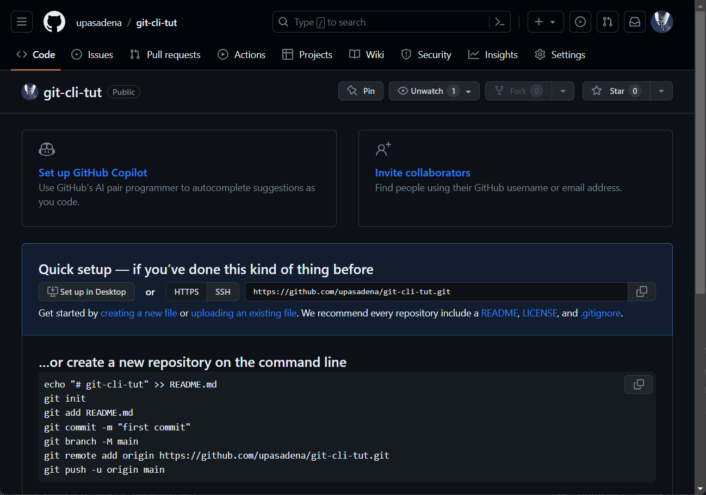

Into a full one:


Note the lack of a `README.md` makes it look bare.

### Reverting changes
Made an irreversible mistake? Don't worry, Git can help (so long as you
committed every so often).

First, you need to get the commit ID you wish to revert to, it usually being
the last one, so use `#!sh git log`.

!!! note

    Both the IDs from `git log` and `git log --oneline` work, but oneline is
    shorter and easier to type if you don't have a mouse to help copy and
    paste.

```sh
$ git log --oneline
0dfd423 (HEAD -> main, origin/main) Another file added!
89e8a4d Update!
2835eb5 Update
1b4bdc3 Update
6db4a53 Initial commit
```

To revert to the last commit, simply put in the ID of the commit that you want
to revert to with the format `#!sh git reset <ID>`:

!!! note

    Use `reset` not `revert`

```sh
$ git log --oneline
0dfd423 (HEAD -> main, origin/main) Another file added!
89e8a4d Update!
2835eb5 Update
1b4bdc3 Update
6db4a53 Initial commit
$ git reset 89e8a4d
Unstaged changes after reset:
M       another_file.md
$ git status
On branch main
Your branch is behind 'origin/main' by 1 commit, and can be fast-forwarded.
  (use "git pull" to update your local branch)

Changes not staged for commit:
  (use "git add <file>..." to update what will be committed)
  (use "git restore <file>..." to discard changes in working directory)
        modified:   another_file.md

no changes added to commit (use "git add" and/or "git commit -a")
```

As we can see, we reversed the commit. However, we did not reverse the changes
we made, only the fact that a commit happened. In order to that, we attach the
`--hard` flag to the command:

```sh
git reset <ID> --hard
```

Which, as we can see, removes the file:

```sh
$ git log --oneline
2835eb5 (HEAD -> main) Update
1b4bdc3 Update
6db4a53 Initial commit
$ ls
another_file.md  icct  test_file.txt
$ git reset 1b4bdc3 --hard
HEAD is now at 1b4bdc3 Update
$ ls
icct  test_file.txt
```

### Putting it all together
After making changes it should look like this:

```sh
git add .;git commit -m "Update!"
git push
```

!!! example

    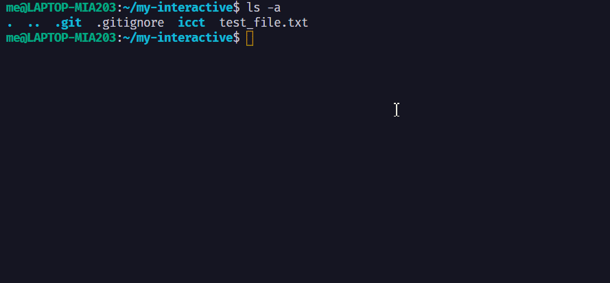

---

And you're all set! You should now know the basics of GitHub and Git, and how
to use them to host your CYOAs!

<!-- ## Free custom subdomains
You may have noticed that this tutorial has a pages.dev subdomain (if you are
viewing from https://icctutorial.pages.dev/). This was gained for free at
[Cloudflare Pages](https://pages.cloudflare.com/). We won't get into setting
that up as of now (but it is planned), but feel free to visit that site on your
own and view the docs. -->

<!-- URLs -->
[github-usage-limits]: https://docs.github.com/en/pages/getting-started-with-github-pages/about-github-pages#usage-limits
[gh-readme]: https://docs.github.com/en/repositories/managing-your-repositorys-settings-and-features/customizing-your-repository/about-readmes
[discord-md]: https://support.discord.com/hc/en-us/articles/210298617-Markdown-Text-101-Chat-Formatting-Bold-Italic-Underline-
[gh-licences]: https://docs.github.com/en/repositories/managing-your-repositorys-settings-and-features/customizing-your-repository/licensing-a-repository
[gh-pages]: https://docs.github.com/en/pages/quickstart
[pat]: https://docs.github.com/en/authentication/keeping-your-account-and-data-secure/managing-your-personal-access-tokens

<!-- BUFFER -->
