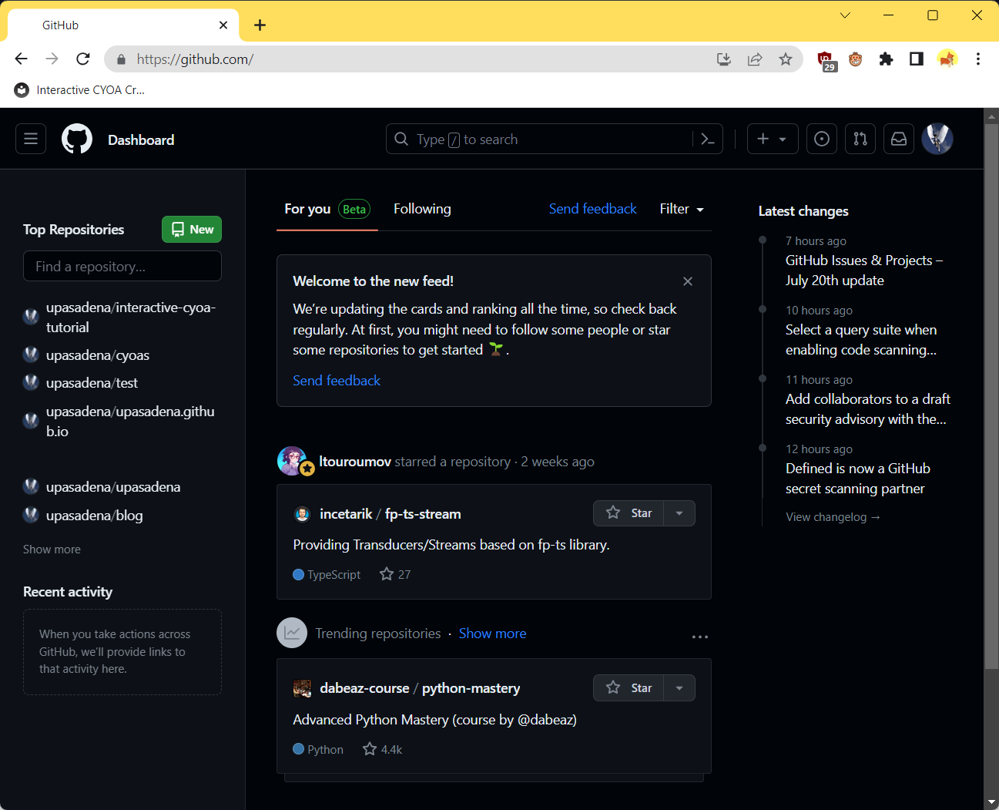
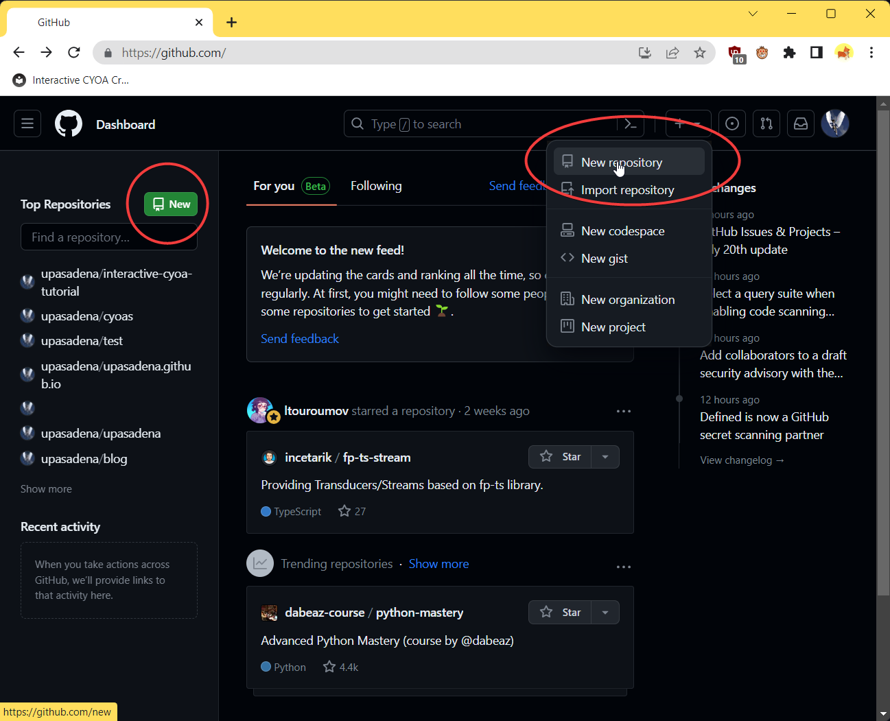
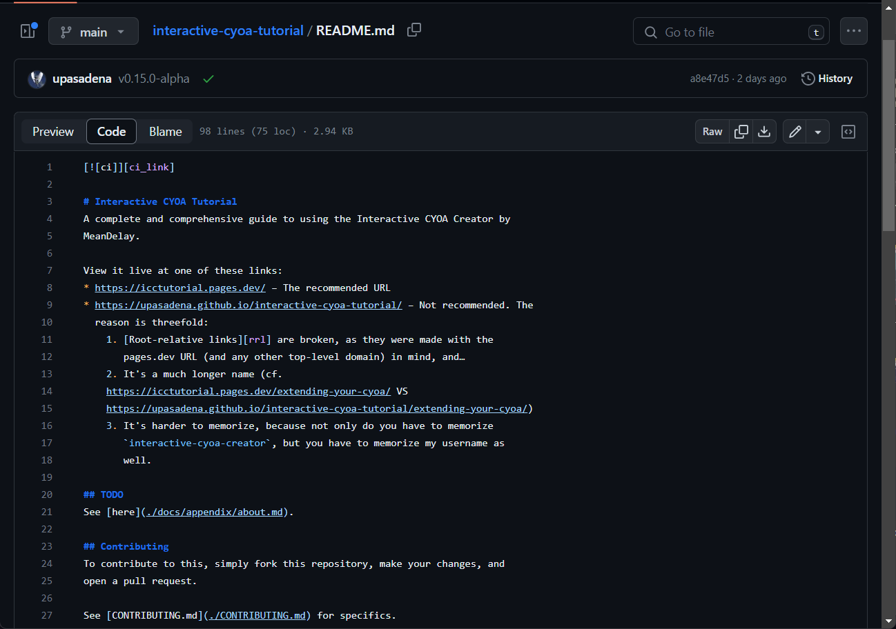
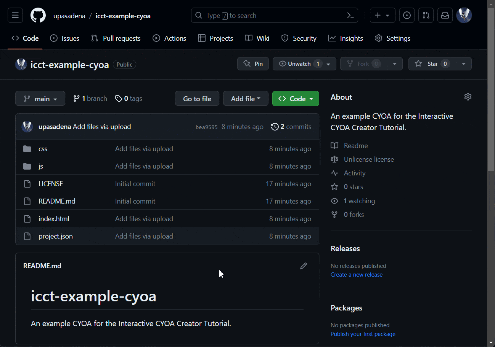
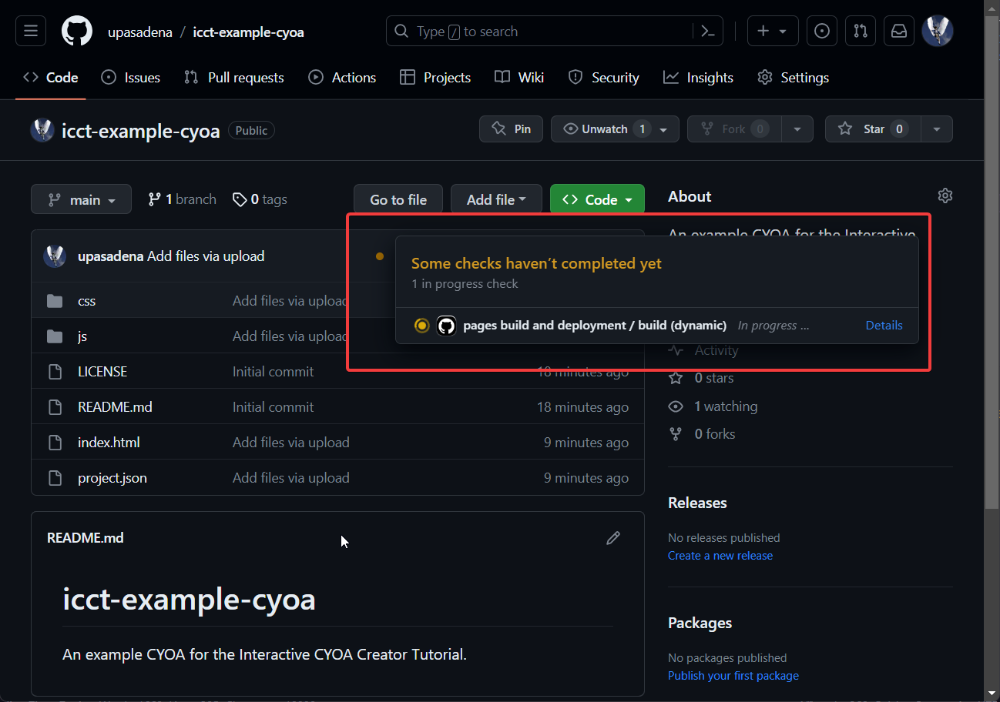
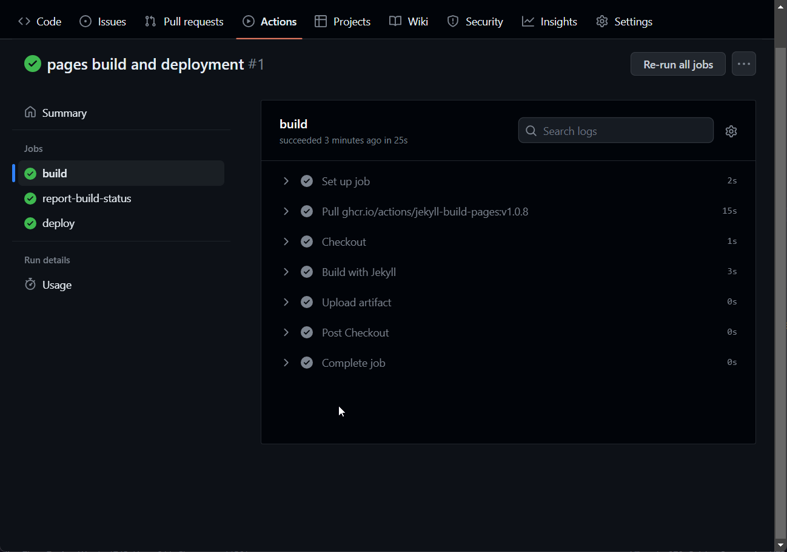
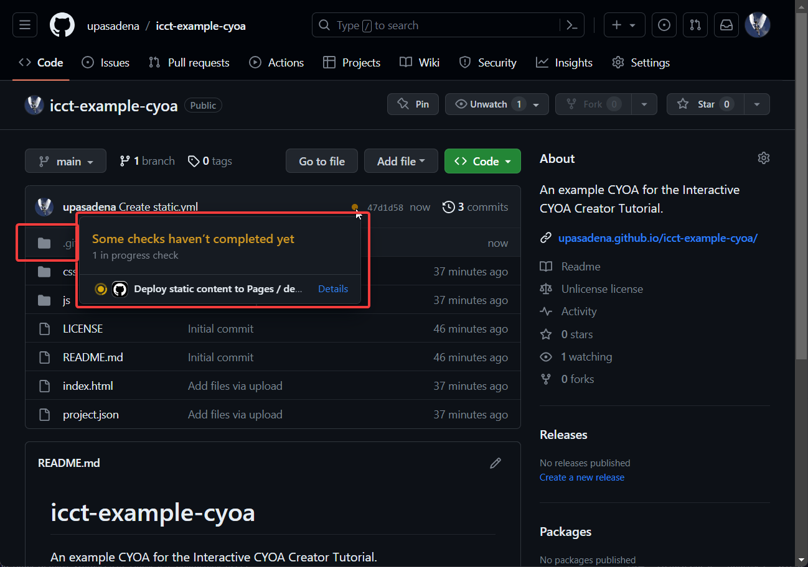
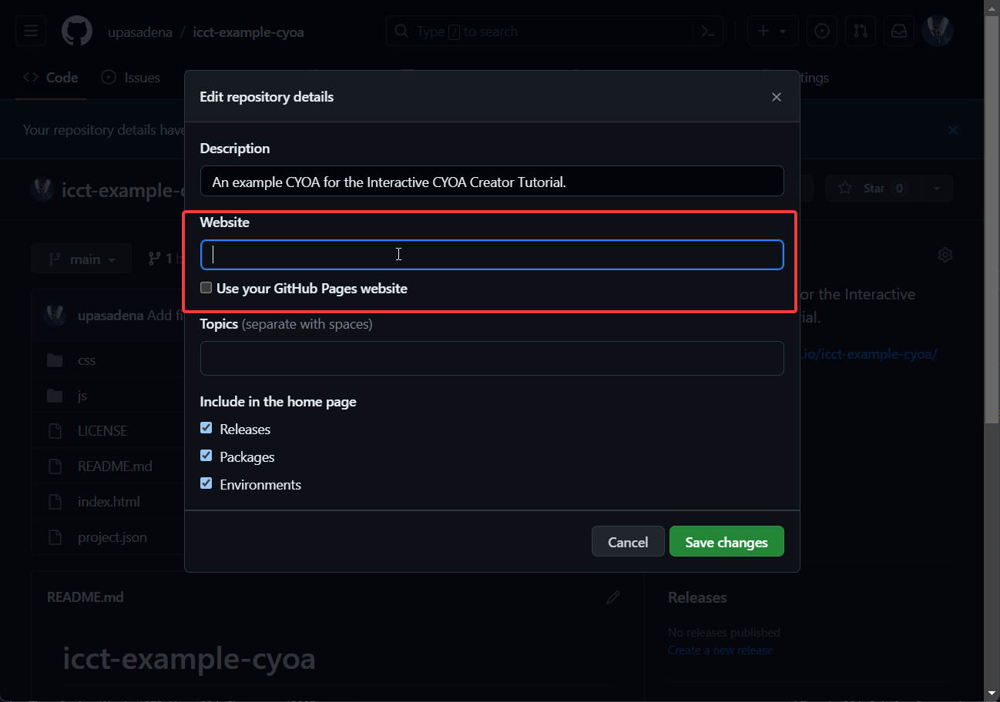

# Publishing on GitHub
What is GitHub? GitHub is primarily a place to store code in "repositories".
Repositories (or repos for short) are essentially folders, where each folder is
a project for one or more applications, libraries, or something else.

Luckily for us, code includes the Viewer and the `project.json`! Using GitHub
is good because there is no limit to the amount of repositories you can create,
and they are very generous with storage space, allocating it *per repo* rather
than *per account*.

## Limits
GitHub has these limits:

* A recommended limit of 1 GB per repository
* A *soft* bandwidth limit of 100 GB per month
* A *soft* build limit of 10 builds per hour, if using the default GitHub
Pages, rather than a custom GitHub actions workflow
* You are only allowed one account, *but* you can create unlimited repository,
  hosting an unlimited amount of 1 GB subfolders under your custom domain.
* Repos must be public to use GitHub pages (this is fine because project.json
  files are stored in plaintext anyway)

See [here][github-usage-limits] for more info.

## Creating an account
To create an account, first go to the site here: [https://github.com/][gh]

[gh]: https://github.com/

That should bring you to this page:


Press the **Sign up** button in the top right and sign up like you usually
would!

You should land on this page now:



## Creating a repo
You can create a repo in two ways, by pressing the green **New** button on the
top left, or expanding the ++plus++ button on the top right, and pressing
**New repository**.



This should open up this form:


### Repository name
This option is how you select the name of your project. I would recommend
naming this after your cyoa, completely lowercase and with dashes instead of
spaces (spaces will automatically be converted to dashes by GitHub).

!!! tip

    I would recommend creating a new repository for each CYOA (at least, if it
    becomes too big). This is because some CYOAs can get incredibly big (JRPG
    Traitor is 363 MB even with compression), and having multiple huge projects
    in one repo can cause problems, such as longer waiting times for the site
    to deploy.


### Description
As this says, it is optional. It shows to you and anyone viewing your GitHub a
short summary of what it's about.


### Public or Private
Keep this on Public if you're a Free user. Free users cannot host Private
repositories (though they can still use them).


### Initialize this repository with
This just adds useful files on creation of the repo.

#### Add a README file
A README file is a file that contains useful information about a directory and
its contents therein. When viewing a repository's code, a `README.md` (the md
meaning Markdown, the markup language that this tutorial is written in) is
prettily displayed at the bottom.

I recommend checking this option if you haven't already created a local git
repository, as it allows you to give information on the CYOA.


As an example, here is what the `README.md` of this tutorial looks like:

=== "Repository"

    !!! example ""

        

=== "Code"

    !!! example ""

        

Learn more about READMEs from GitHub [here][gh-readme].

Learn Markdown easily [here](https://commonmark.org/help/).

!!! info

    Fun fact, if you know how to bold and italicize text in Discord, you
    already know [a flavour of Markdown][discord-md].

#### Add .gitignore
You can, heh, ignore this. We won't need a `.gitignore` for the purposes of
this tutorial, so just leave it at **None**.

!!! question "What is a .gitignore used for?"

    Some programming languages and tools, when building applications leave
    residual files and folders laying about, and people may have database
    passwords and API keys and secrets in files.
    
    A `.gitignore` file is used to ignore uploading them so that the developers
    don't accidentally leak their information or upload files that aren't
    necessary to running the application.

!!! danger

    A .gitignore is only used when using [Git CLI](#git-cli). If you upload
    files from the web, **you can upload unwanted files**.

#### Choose a license
As GitHub says,

> A license tells others what they can and can't do with your code.

If you wanted to control how others use your `project.json` (because no one but
MeanDelay has the rights to the Viewer), you can do so using a Licence here.


A couple of common licences include:

For source code (such as the `README.md` and `project.json`):

* [MIT](https://choosealicense.com/licenses/mit/) – You can do anything with it
  but you have to credit me (by including the licence), and I am not
  responsible for what you do with it
* [AGPLv3](https://choosealicense.com/licenses/agpl-3.0/) – You can do anything
  with it but:
    * You have to make it open-source (such as uploading it publically on
      GitHub) if you're distributing it
    * You have to include this licence, including copyright notices
    * Serving this over the internet counts as distribution
    * You have to use this licence too
    * You have to state your changes
    * I am not responsible for what you do with it

For content (such as for making a static CYOA or original content inside of the
`project.json`):

* [CC BY](https://creativecommons.org/licenses/by/4.0/) – You can do anything,
  but you must credit me
* [CC BY-SA](https://creativecommons.org/licenses/by-sa/4.0/) – You can do
  anything, but:
    * You must credit me, and
    * You must use this licence for any derivative works
* [CC BY-NC](https://creativecommons.org/licenses/by-nc/4.0) – You can do
  anything, but:
    * You must credit me, and
    * You cannot use the material commerically
* [CC0] – This work is dedicated to the public domain, you can do anything with
  it!
    * An equivalent for source code is [The Unlicense].

[The Unlicense]: https://choosealicense.com/licenses/unlicense/
[CC0]: https://creativecommons.org/publicdomain/zero/1.0/

!!! info

    Fun fact, the AGPLv3 is the licence that this tutorial is using for its
    source code. For its content, it is licensed under [CC0], a dedication to
    the public domain!

Learn about more licences [here][gh-licences].

---

Overall, this only matters if you expect others may want to create derivative
CYOAs (such as how Lt Ouroumov's Worm CYOA V6 is a fork of PixelGMS's
original).

Additionally, it's a bit of a legal grey area considering you could potentially
be hosting copyrighted content such as images and text (if you're adapting
someone else's CYOA). To play it safe, you can:

* [Attribute images to their authors][image-credit] (asking for permission may
  not be tenable if the project is large enough or if the authors don't
  respond)
* Ask for permission from whoever made the original static, and
* Write in your `README.md` that you are only licensing the unique content in
  the `project.json`, such as the Mechanics, Styling, etc

[image-credit]: /mechanics/images/#tooltip-that-shows-when-hovering-over-it

### Creating the repo
To actually create the repo now, press the **Create repository** button.


You should now have made a repository!


## Uploading files
To upload files is easy, simply press the **Add file** dropdown menu, and
select **Upload files**.


!!! note

    You cannot upload empty directories, you must have a file inside of them.

To upload your site, simply upload the Viewer files and your `project.json`!

!!! tip

    Try dragging and dropping rather than choosing your files. I've had
    problems with uploading folders using that method.

!!! example ""

    

## Publishing to GitHub pages
Now that your site is uploaded, it's time to publish it for the world to see!

There are two methods we will be using in this tutorial: Jekyll and Actions.
There are pros and cons to both:

| Method          | Pros                                                               | Cons                                                                                | Use case                                                                                                               |
| --------------- | ------------------------------------------------------------------ | ----------------------------------------------------------------------------------- | ---------------------------------------------------------------------------------------------------------------------- |
| **Jekyll**      | + Allows using Markdown (.md) files<br/>+ Jekyll themes<br/>+ Easy | - Slower to deploy<br/>- Can be bloat if you don't need it                          | If you want to host information alongside CYOAs, such as Changelogs or a Version select, or if you have multiple CYOAs |
| **Static HTML** | - Faster to deploy and lightweight                                 | - To display information you will need to use HTML and CSS<br/>- Needs to be set up | If you want to simply host CYOAs and that's it                                                                         |

### Using Jekyll
This is the default action that GitHub uses, and it's very easy to set up.

Simply go into **Settings** → **Code and Automation/Pages** → **Branch** →
Change _None_ to _main_ → **Save**.

This will start the build process.

!!! example ""

    

Going back to your repository you should see an orange icon, this indicates
that GitHub Actions is working in the background to publish the site.


Pressing on that icon gives you an overview of its status:



And pressing details should give you even _more_ details:


After some time, it will complete:



You should be able to access your CYOA at
`https://your-user-name.github.io/your-repo-name/` now!


You can repeat this with each and every CYOA you've made, and they will all be
available under the subfolders of your special custom domain!

This example will always be available at
[https://upasadena.github.io/icct-example-cyoa/][icct-ex-cyoa].

[icct-ex-cyoa]: https://upasadena.github.io/icct-example-cyoa/

If you want a quick way to get your link, see
[Adding a link to your project](#adding-a-link-to-your-project) down below.

### Using Static HTML
If you didn't want to use Jekyll and just wanted to serve the files as-is, this
is the option for you!

To start with, go into the Pages menu in the Settings. Select the **Source**
dropdown menu and select **GitHub Actions**.


You should see two suggestions workflows now. Select **Configure** under
**Static HTML**:


If it's not there, copy and paste this:

??? Static HTML workflow

    ```yaml
# Simple workflow for deploying static content to GitHub Pages
name: Deploy static content to Pages

on:
  # Runs on pushes targeting the default branch
  push:
    branches: ["main"]

  # Allows you to run this workflow manually from the Actions tab
  workflow_dispatch:

# Sets permissions of the GITHUB_TOKEN to allow deployment to GitHub Pages
permissions:
  contents: read
  pages: write
  id-token: write

# Allow only one concurrent deployment, skipping runs queued between the run in-progress and latest queued.
# However, do NOT cancel in-progress runs as we want to allow these production deployments to complete.
concurrency:
  group: "pages"
  cancel-in-progress: false

jobs:
  # Single deploy job since we're just deploying
  deploy:
    environment:
      name: github-pages
      url: ${{ steps.deployment.outputs.page_url }}
    runs-on: ubuntu-latest
    steps:
      - name: Checkout
        uses: actions/checkout@v3
      - name: Setup Pages
        uses: actions/configure-pages@v3
      - name: Upload artifact
        uses: actions/upload-pages-artifact@v2
        with:
          # Upload entire repository
          path: '.'
      - name: Deploy to GitHub Pages
        id: deployment
        uses: actions/deploy-pages@v2
    ```

    Put it in a file under `.github/workflows/static.yml`. You can do this
    straight from the browser by selecting **Add file** → **Create new file**
    from your repository root. Where it says to name your file up the top,
    pressing slashes will create folders for you if they don't exist.

Save the file by committing your changes.

You should notice it is rebuilding now, and you have a new `.github` folder:



As you can see here, there *is* a performance difference, even for such a small
repository, so you can be rest assured if you have a massive one, then swapping
over to _Static HTML_ will improve the deployment times. This is useful if you
want to send out updates to your audience quickly.


!!! question "Why does Jekyll take longer?"

    This is because Jekyll is an external framework that takes in Markdown
    files and outputs them to HTML. So GitHub Actions has to not only download
    and install Jekyll AND your Git repository, but it must then convert any
    Markdown files to HTML.

    Whereas _Static HTML_ simply just uploads your files to a web server, and
    serves them as-is, making the progress significantly faster.

### Adding a link to your project
If you want to quickly get the link to your site and have it ready to press in
your repo, you'll want to do this. This is especially useful for newcomers who
may want to preview your site, but don't have the time to host it themselves.

Simply press the settings icon in the top right (but NOT the settings tab, a
bit below that, to the right of About) → and tick
**Use your GitHub Pages website**.

You can also manually input a website in the Website input field if you were
hosting elsewhere.



!!! example

    

## Unpublishing your site
If you ever need to take down the site for some reason, it's simple!

Navigate to Pages in the settings, press the three buttons where it says your
site is live, and press **Unpublish site**.


## Configuring your root site
If you wanted to configure the very root of your site (Such as
`https://yourname.github.io/`) then it's simple. Just create a repository
called `yourname.github.io`, and activate Pages for that.

---

Learn more about GitHub Pages [here][gh-pages]

## Git CLI
!!! note

    This topic is for more advanced users.

<!-- ## Free custom subdomains
You may have noticed that this tutorial has a pages.dev subdomain (if you are
viewing from https://icctutorial.pages.dev/). This was gained for free at
[Cloudflare Pages](https://pages.cloudflare.com/). We won't get into setting
that up as of now (but it is planned), but feel free to visit that site on your
own and view the docs. -->

<!-- URLs -->
[github-usage-limits]: https://docs.github.com/en/pages/getting-started-with-github-pages/about-github-pages#usage-limits
[gh-readme]: https://docs.github.com/en/repositories/managing-your-repositorys-settings-and-features/customizing-your-repository/about-readmes
[discord-md]: https://support.discord.com/hc/en-us/articles/210298617-Markdown-Text-101-Chat-Formatting-Bold-Italic-Underline-
[gh-licences]: https://docs.github.com/en/repositories/managing-your-repositorys-settings-and-features/customizing-your-repository/licensing-a-repository
[gh-pages]: https://docs.github.com/en/pages/getting-started-with-github-pages/configuring-a-publishing-source-for-your-github-pages-site

<!-- BUFFER -->