# Backgrounds
Backgrounds are images that are displayed beneath all the other elements, such
as text. This is including, but not limited to, the background of the entire
CYOA. But Backgrounds are also found within Choices and Rows too.

## Choosing a Background
!!! tip

    Backgrounds should at least be 1920x1080 pixels in order for a good
    experience for most users.

## Manage Background Design
To get to this menu, go into **the Sidebar** → **Modify Design** →
**Manage Background Design**.

It should now open this menu:

!!! tip

    Style menus only show at the very top of the Creator, meaning trying to
    access them for the bottom of your CYOA is impossible.

    If that happens, you will need to scroll all the way up.

### Color of the background
This option allows you to set the colour for the ENTIRE CYOA's background.

This is what it looks like:

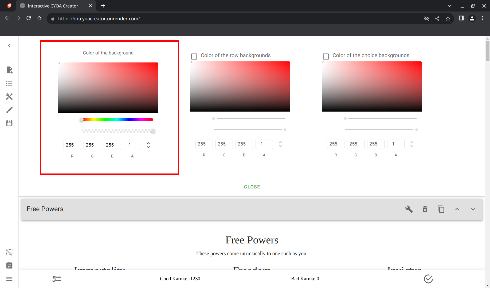

And then choose a colour:

=== "Styled"

    !!! example ""

        

=== "Default"

    !!! example ""

        

=== "Setup"

    !!! example ""

        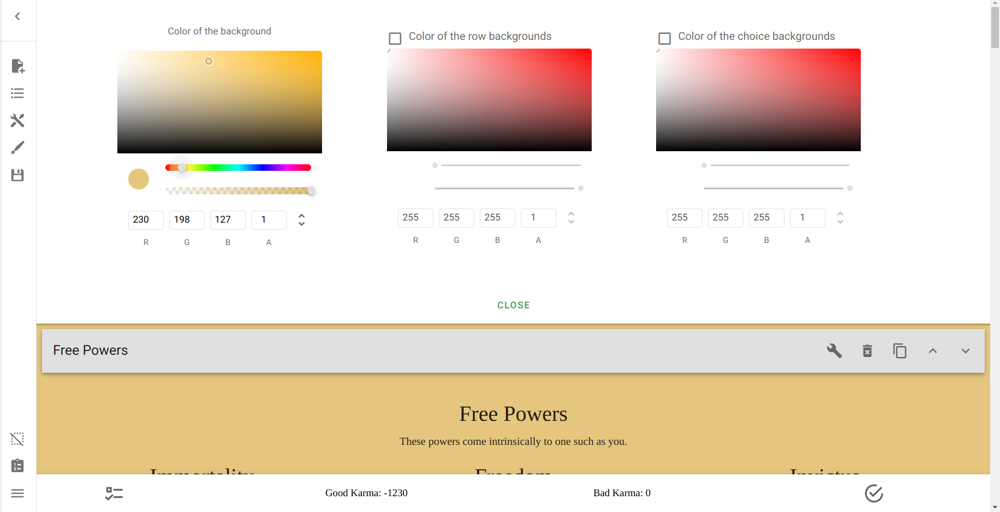

### Upload Background Image
This option allows you to use an image instead of a colour for the entire
CYOA's background.

!!! note

    If the option isn't showing (which is a well-known bug), see [here][imgfix]
    for a fix on how to get it to show up.

This should be the option:

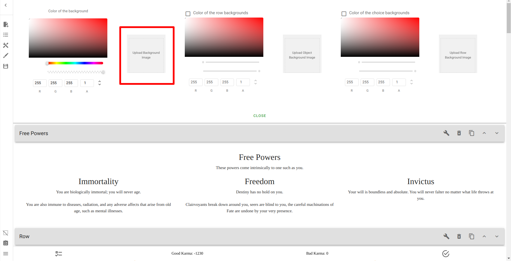

Simply press that button and [upload an image] like normal.

[upload an image]: /mechanics/images/#the-image-menu

This is how it should look:

=== "Styled"

    !!! example ""

        

=== "Default"

    !!! example ""

        

=== "Setup"

    !!! example ""

        
### Color of the row backgrounds
This option allows you to change the colour of the background of Rows.

To begin, you first must select the checkbox next to the
**Color of the row backgrounds** title.

=== "Off"

    !!! example ""

        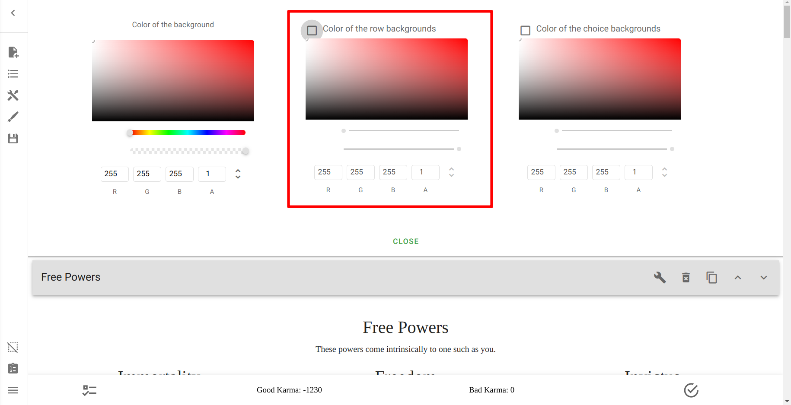

=== "On"

    !!! example ""

        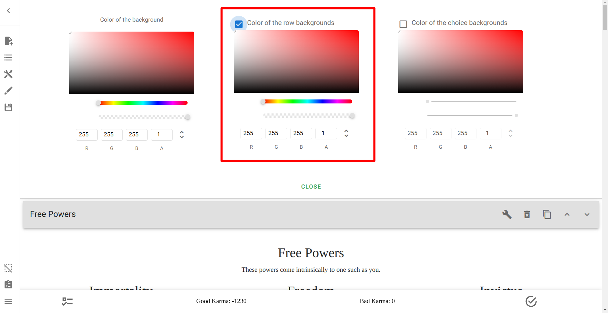

Now, the colour picker can be edited. Here's how it looks:

=== "Styled"

    !!! example ""

        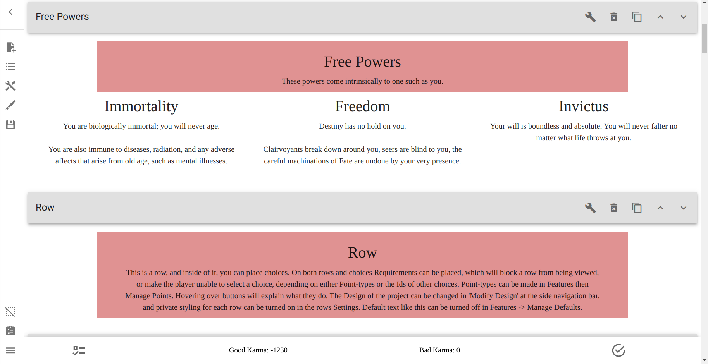

=== "Default"

    !!! example ""

        

=== "Setup"

    !!! example ""

        

### Upload Row Background Image
This option allows you to replace the Background of the Row only.

!!! warning

    The **Upload Row Background Image** and **Upload Object Image Background**
    buttons have essentially swapped places from where they should be.

    Make sure that you select the correct one.

This is the option:

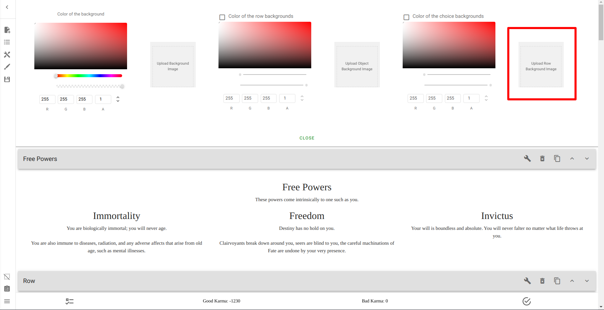

And this is what using it looks like:

=== "Styled"

    !!! example ""

        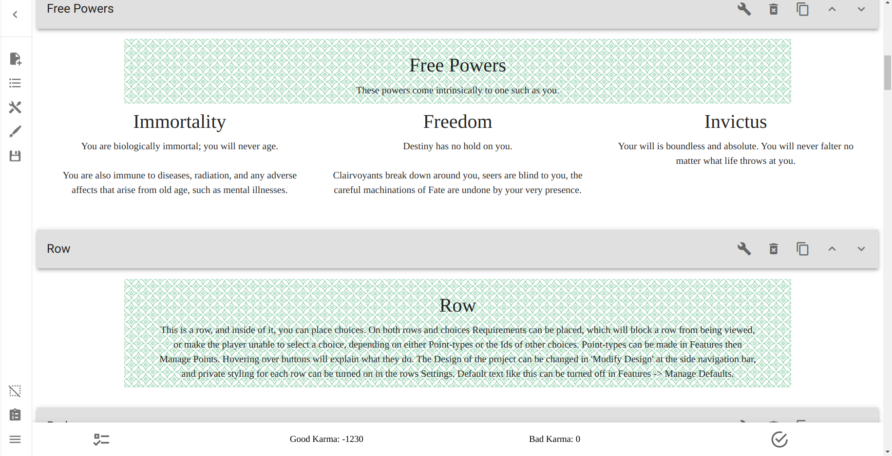

=== "Default"

    !!! example ""

        

=== "Setup"

    !!! example ""

        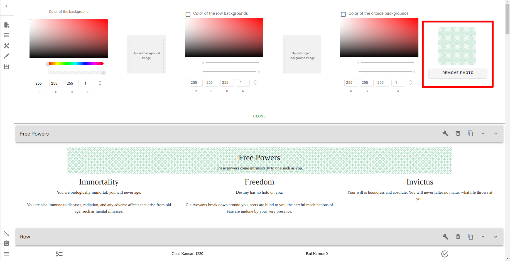

### Color of the choice backgrounds
This option allows you to set up the colour of the Choices' backgrounds.

Like the Row Colour picker, you must select the checkbox in order to apply a
colour.

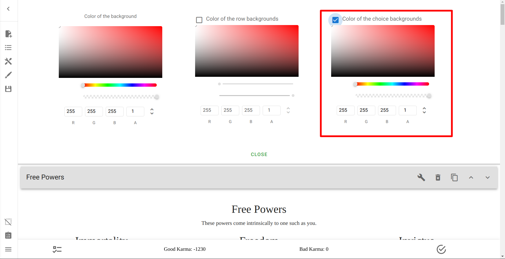

Using it should look like this:

=== "Styled"

    !!! example ""

        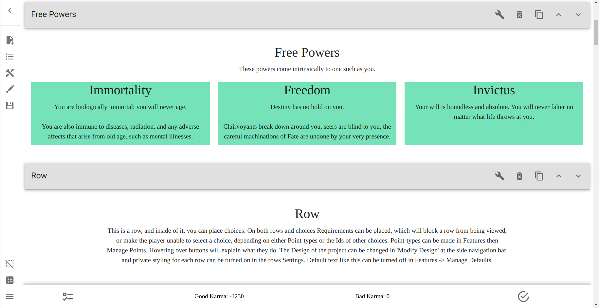

=== "Default"

    !!! example ""

        

=== "Setup"

    !!! example ""

        

### Upload Object Background Image
This option allows you to set an image for the Backgrounds of Choices instead
of a colour.

!!! warning

    The **Upload Row Background Image** and **Upload Object Image Background**
    buttons have essentially swapped places from where they should be.

    Make sure that you select the correct one.

You can find it here:

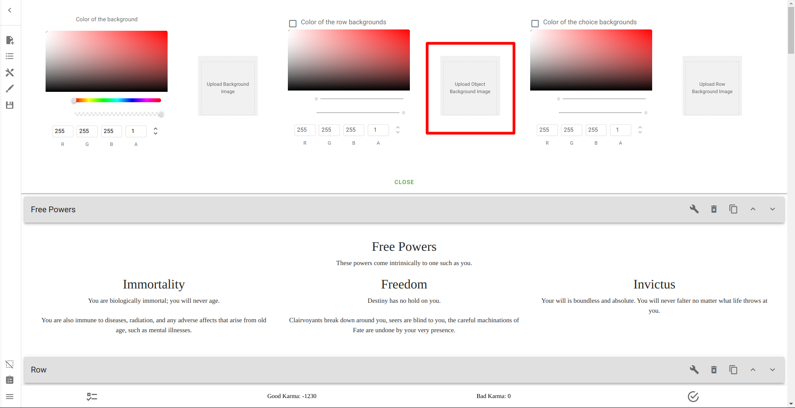

And this is what it looks like when used:

=== "Styled"

    !!! example ""

        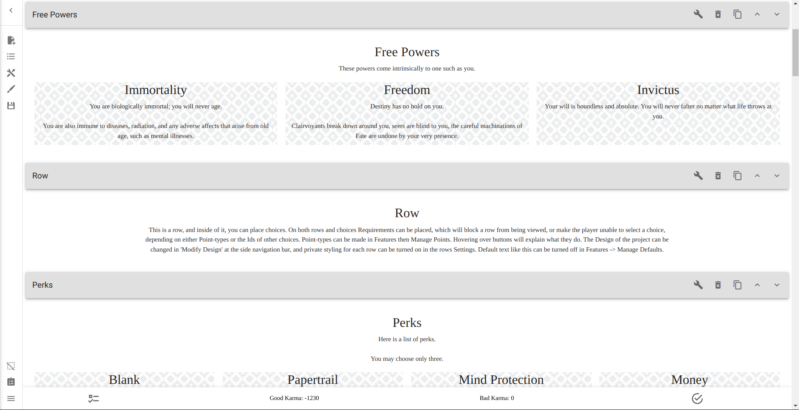

=== "Default"

    !!! example ""

        

=== "Setup"

    !!! example ""

        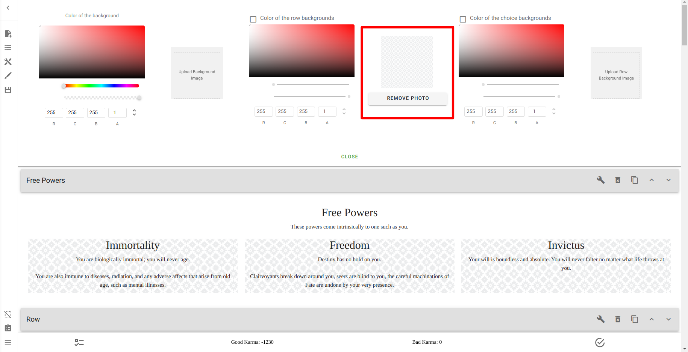

## Putting it together
Using all that we've learned here today, we can create the very basis of our
final design.

### Using Images

=== "Styled"

    !!! example ""

        
    
=== "Default"

    !!! example ""

        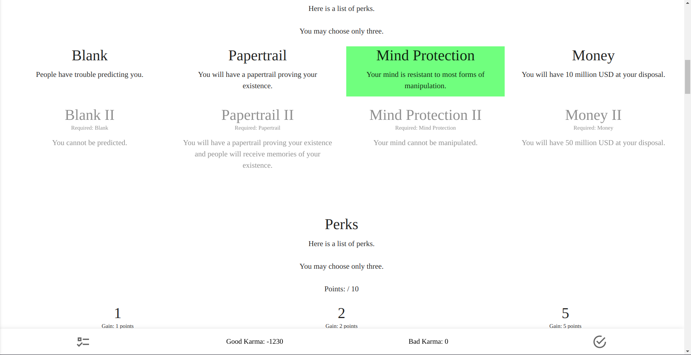

<!-- ### Complete Dark Theme

!!! note

    I have changed the colour of the text, which, if you were following along
    this tutorial sequentially, we have not covered yet. -->

<!-- TODO example with darker background and lighter choices -->
<!-- TODO example with lighter background and darker choices -->

---

Learn more about what you can do with Backgrounds in the [Reference](/appendix/reference).

<!-- URLs -->
[imgfix]: /appendix/troubleshooting/#i-cant-find-the-option-to-upload-a-background-image

<!-- BUFFER -->