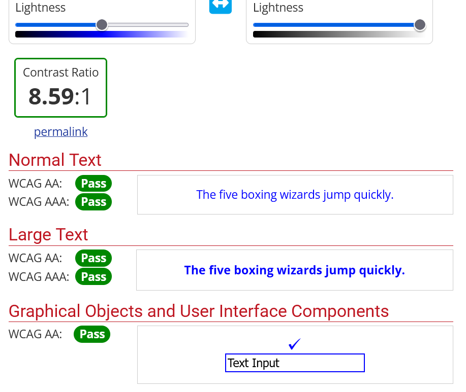
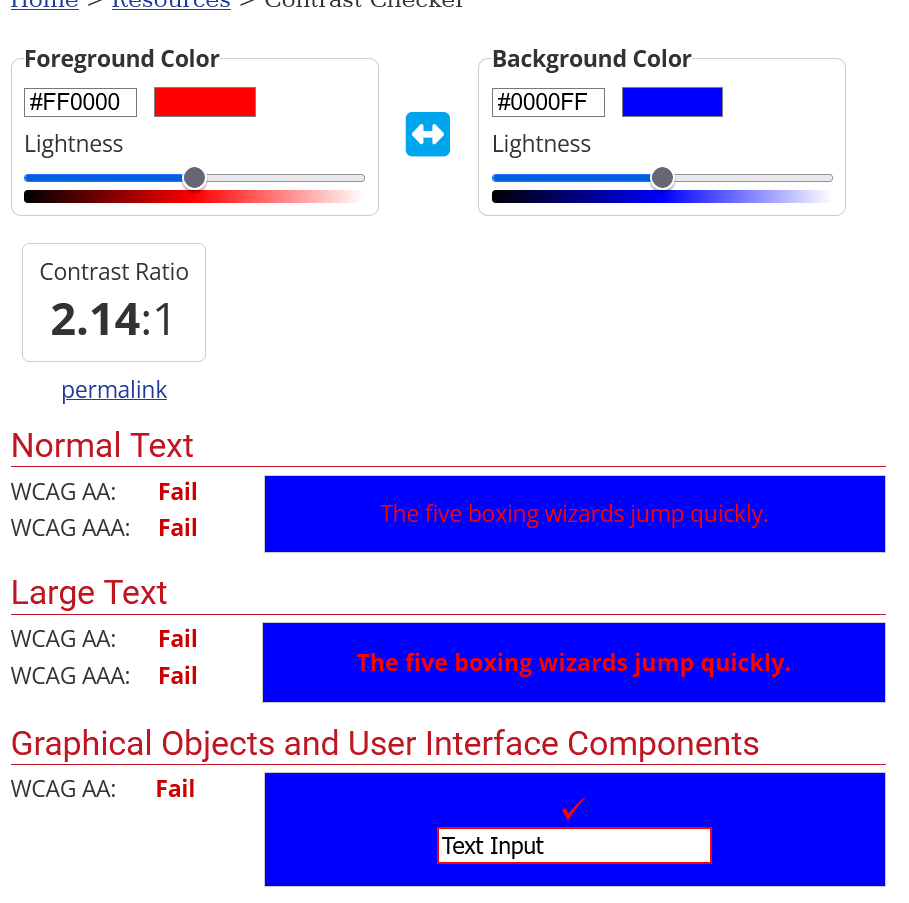
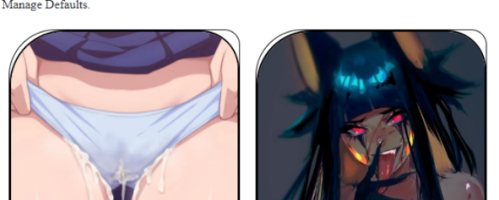
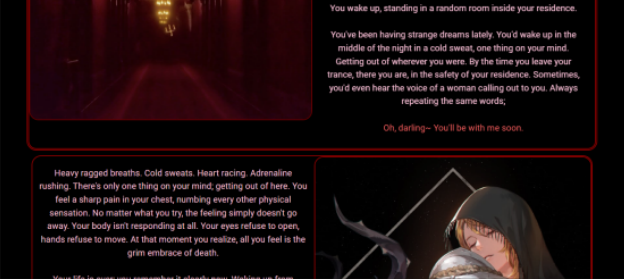
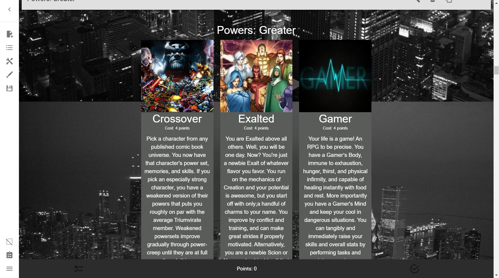

# Design

## (TODO LINK)
This section of the tutorial is not based on the mechanics of the Creator, but
instead on how to design. If you are not interested in theory, feel free to
skip ahead to the [next chapter].

## Important Advice
**BEFORE** styling your CYOA, make your that the core functionality (text,
scoring, logic, and images) of it is finished.

The reason is twofold:

1. Because as you make your CYOA you might be tempted to make private styling
   choices, which is not advisable (the reasons of which are below)
2. Excessive styling may slow down the preview slightly, meaning it will be
   that much harder to edit your CYOA.

**BEFORE** using private styling, make sure that you have styled all of the
CYOA using the global options. This is because once private styling is turned
on, the styling cannot be overridden by the global options.

So if, for example, you decide you like a different font in CYOA, but you have
a dozen private stylized sections, you would need to either:

1. Go to each of those sections for each change you make, and change the
   private styling, or
2. Turn off private styling to reset the styling, then reapplying the private
   style options for each section.

Both of which are very time consuming. It is important to design top-down, so
to speak.

### StarDustAnon's Advice
Below is a snippet from [Some Musings by a CYOA Author] by StarDustAnon, a text
focused on advice for creating static CYOAs. Although for static CYOAs, I
believe this advice applies no matter the format a CYOA is presented from.

> I know what I said before: graphics isn't entirely necessary. But ==design
> isn't the same as graphics. Design encompasses your CYOA no matter what.
> Design is how your readers see your CYOA.==
> 
> You can't go wrong with a simple text document. The text is easily readable,
> you can add images here and there depending on what program you use, you can
> change fonts and styles a little. But for the most part, a text document is
> purely about presenting the guts of your product: the writing.
> 
> Believe it or not, text has design to it, even if you simply go with default
> fonts and no pictures for your CYOA. I should clarify: you can't go wrong
> with a simple text document -while- utilizing default fonts. Default fonts
> (TNR, Arial, Helvetica, etc) are all fonts made to be legible at the default
> font size (usually 12). 
> 
> So then you decide to step into the world of more vibrant design choices.
> Maybe you've seen a nice looking font you want to use and you decide to use
> it. ==Consider this carefully: how hard is it to read your text now? Does it
> make you squint your eyes? Does it strain them? Hell, does it even make your
> eyesight stutter a little bit, no matter how minuscule? If yes, then you've
> made a bad design choice.== No, this doesn't mean to back-track immediately
> before the world ends. If it's a minuscule problem, it's a minuscule bad
> design choice. Just be mindful that it will affect your reader's experience.
> 
> ==For body text, you always want to stick with clean, easy-to-read fonts. If
> you have a portion of text that's more than five words, it's probably better
> to have it as an easy-to-read font.== However, ==if you have a simple title
> or name, feel free to stylize it. This is what stylish text is for:
> eyecandy==, and it's best reflected in the titles that represent your CYOA,
> right? Besides, you usually want to have your titles a larger font size than
> your body text, so titles can accommodate more complex graphics.
> 
> The second most important thing when considering design is your colour
> choices. Again, you can't go wrong with the default: black text on white
> background. It's the perfect contrast whose singular goal is legibility.
> White text on grey background is even better, as it promotes less eye strain.
> 
> ==The two main things you have to consider when choosing your colours is
> contrast and eye strain, which go hand-in-hand. Is your text contrasted
> enough with its background to be easy to read? Is it too contrasted to make
> it hard to read? Are the colours too saturated?== One of the things I hate
> the most in bad design is oversaturation. I spend a lot of time just picking
> the colours to use, and you'll notice in a lot of my works that the colours I
> like to roll with are rather modest. Even in something vibrant like
> Battlemage, I choose blues, reds, and greens that have a healthy mix of
> greyish shades mixed in. ==Saturation is for things you want to emphasize or
> highlight. A border around a title? Make it glow to show its brilliance.==

To summarize:

1. Text that is clean and easy-to-read is good design
2. Text that is hard to read and straining is bad design
3. Colours with too much contrast and saturation are bad design

## Contrast
> **contrast** *noun*
> 
> differences in colour, tone, or shape that contribute to the visual effect of
> a design or image.

Contrast is good. With a low amount of contrast we would not be able to tell
where one thing ends and another begins. But like with all things, too much of
it is just as bad a thing. High contrast can make your text straining to read,
which is not what we want as ICYOA creators.

So how do you tell if your colour palette has too much contrast? Well there are
tools to help with that. Consider [Contrast Checker]. It is tool where you can
compare foreground and background colours to see if it has good contrast or
not[^1].

!!! tip

    People often perceive the blue part of the visible spectrum a little worse,
    so blue on a black background can be poorly read, despite sufficient
    contrast.[^2]

Here's an example of good and bad contrast:

=== "Good Contrast"

    

=== "Bad Contrast"

    

As you can see, this tool can tell us whether our colour palette has too much
of a high contrast, and it can tell us where it starts becoming easy on the
eyes.

There are other resources for this, such as:

* [Colour Contrast Checker](https://colourcontrast.cc/) – A website that
  performs much the same function. Try to get as many passes as possible, at
  least passing AA Normal[^peanuts_1987].
* [Link Contrast Checker], much the same as the Contrast Checker from earlier,
but takes links into account.
* [WAVE](https://wave.webaim.org/), a tool to check the accessibility of an
entire page.

## Consistency
It's a good idea to have a sense of uniformity and consistency across the CYOA;
Images should be the same size and aspect ratio (at least within the same
section), Choices and Choice Images should have the same border radius for
rounding, etc.

[previously]: #important-advice

??? example "(NSFW WARNING) Example of inconsistent border radii[^dragons-whore]"

    

This is also why it's important to do the overall styling *before* private
styling, as mentioned [previously]. Here's an example of a consistent style,
from Succubus Manor CYOA:

## Objects Per Row
The optimal number depends on the amount of text you use in the
descriptions.

If the description is only a few words, you can use as many as 7 or 8. The
ratio of text height will still be nice.

But if there are several sentences, please use only 4 or 5 max. Otherwise,
the text will stretch into a completely unpleasant and uncomfortable to
read column[^dragons-whore].

For example:

=== "Before"

    

=== "After"

    

Which looks nicer to you?

<!-- Footnotes -->
[^1]: Credit to `spartango` on Discord for making me aware of this website
[^dragons-whore]: Credit to [Dragon's Whore](https://imgchest.com/p/ej7mkx9qydl) for this
[^peanuts_1987]: Credit to `peanuts_1987` on Discord for this

<!-- URLs -->
[Contrast Checker]: https://webaim.org/resources/contrastchecker/
[Link Contrast Checker]: https://webaim.org/resources/linkcontrastchecker/
[next chapter]: _
[Some Musings by a CYOA Author]: https://pastebin.com/qaL8nDD8